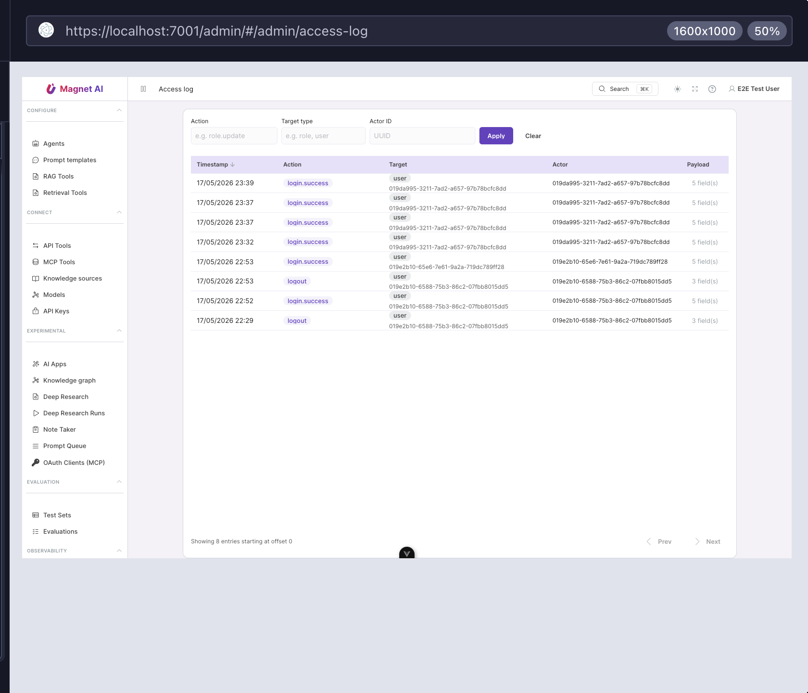

# Access log

The **Access log** is an append-only audit trail of every
governance-relevant action in your tenant: logins, role and user
edits, record-level grants, and explicit grant / denial events on
sensitive resources. Open it at **System → Access log** in the
admin sidebar.

::: tip Permissions
Viewing the access log requires `read:audit`. The page is hidden
from the sidebar when the current user does not hold this
permission.
:::

## What gets logged

Each entry contains:

- **Timestamp** — UTC, millisecond precision.
- **Action code** — see the table below.
- **Target** — `(target_type, target_id)`, e.g.
  `role` + a UUID, or `user` + a UUID.
- **Actor** — the user ID who performed the action (or `system`
  for migrations / bootstrap scripts).
- **Trace ID** — links the entry to the request log lines, so you
  can pivot from an audit row to the full HTTP request and
  back-end logs in Grafana / Loki.
- **Payload** — a JSON diff of what changed (added permissions,
  removed role IDs, principal of a grant, etc.). Click a row to
  expand.

## Action codes

The action code is a dot-delimited string identifying what
happened. Current set:

### Authentication
| Action | Description |
|---|---|
| `login.success` | Successful login (any provider). |
| `login.failure` | Failed login attempt. Records reason in payload. |
| `logout` | User logged out. |

### Users
| Action | Description |
|---|---|
| `user.update` | User profile fields changed. |
| `user.role.assign` | A role was attached to a user. |
| `user.role.revoke` | A role was removed from a user. |

### Roles
| Action | Description |
|---|---|
| `role.create` | A custom role was created. |
| `role.update` | A role's name or description changed. |
| `role.permissions.replace` | The role's permission set was replaced (full diff in payload). |
| `role.delete` | A custom role was deleted. |

### Record-level events
| Action | Description |
|---|---|
| `view` | An access check evaluated for a view action. Only logged when access was denied. |
| `edit` | Same as `view`, for edits. |
| `delete` | Same, for deletes. |

`view` / `edit` / `delete` entries appear when controllers call
`enforce_action_or_403` or `enforce_view_or_404` and the principal
fails the check. The target identifies the resource that was
rejected; the actor is the requesting user.

## Filtering

The toolbar offers three filters. Type a value and press **Apply**
(or Enter inside any field):

- **Action** — substring match against the action code, e.g.
  `role.update`.
- **Target type** — exact match, e.g. `role`, `user`, `agent`.
- **Actor ID** — exact UUID.

Press **Clear** to drop all filters. Pagination uses
**Prev** / **Next** at the bottom; each page shows 50 entries.

## Investigating an incident

A typical workflow:

1. **Filter** by the affected user's ID (`actor_id`) or the
   suspected resource type.
2. Identify the suspicious row and **expand** it to read the
   payload diff.
3. Copy the **trace ID** from the row.
4. Open Grafana → Loki and query
   `{application="magnet-ai"} |= "<trace_id>"`. You will see every
   API call that participated in the request, plus the resulting
   service log lines.

If you don't yet have logs wired up, see the
[Logging guide](../../developers/guides/logging) — `logger="api"`
and the trace ID are correlated by middleware on every request.

## Retention

Access log rows are never deleted by the application. If your
compliance regime requires retention pruning, schedule a
PostgreSQL job that deletes rows older than your policy window
(`access_audit_log` table). The rest of the application does not
read the log, so deletion is safe.
