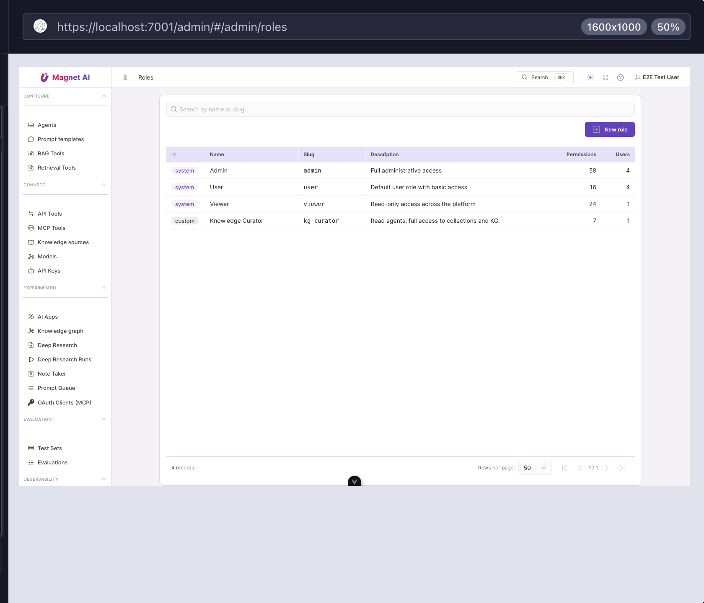

# Managing roles

Open **System → Roles** in the admin sidebar. The list shows every
role available in your tenant: the three system roles first
(`admin`, `user`, `viewer`) followed by any custom roles you have
created. Each row shows the role name, slug, description, the count
of permissions it grants, and the number of users assigned.

::: tip Permissions
Listing roles requires `read:roles`. Creating and editing custom
roles requires `write:roles`. System roles are always read-only —
the backend rejects mutations even from admins.
:::

## System roles

System roles are seeded by database migrations and cannot be edited.
Three ship out of the box:

| Slug | Intent | Permissions |
|---|---|---|
| **admin** | Tenant administrator | Every permission in the catalog |
| **user** | Regular employee | Read on most resources, execute on agents, write on files and the Note Taker |
| **viewer** | Read-only auditor | Every `read:*` permission, nothing else |

To customise behaviour, **duplicate** a system role into a custom
tenant role (see below) and then edit the copy.

## Creating a custom role

On the roles list page, press **New role** (visible only when you
hold `write:roles`). The dialog asks for three fields:

- **Slug** — URL-safe identifier. Must be unique within your tenant
  and must not collide with a system slug. Example: `reviewer`.
- **Name** — Display name shown in the UI and in user-detail role
  pickers. Example: `Reviewer`.
- **Description** — optional free text, surfaced as the column in
  the roles list.

A freshly created role starts with **zero permissions**. Press
**Create** to commit; you land directly on the role's detail page.

::: tip Cloning a system role
On any system role's detail page, the **Duplicate as custom** button
opens the same dialog pre-filled with the system role's permission
set, so you can start from `admin` / `user` / `viewer` and trim down
without rebuilding from scratch.
:::

## Editing the permission matrix

The role detail page shows the role's metadata at the top and the
**permission matrix** below. Rows are resource types (`agents`,
`ai_apps`, `collections`, `prompts`, …). Columns are actions
(`read`, `write`, `delete`, `execute`, `share`, `manage`). A
checkbox sits in every cell where that combination exists in the
catalog; otherwise an em-dash.

Three quick operations:

- Click a **column header** to toggle the whole column on or off.
- Click **Clear all** to deselect every permission.
- Click **Select all (allowed)** to select every permission you are
  yourself authorised to grant.

The summary line above the matrix shows `<selected> of <total>
permissions granted` so you can sanity-check large changes. Press
**Save** when ready.

### Capability ceiling on the matrix

Permissions you do not hold yourself are disabled in the matrix —
you cannot bestow a capability you lack. Already-selected codes stay
clickable so you can always clear a grant, even on permissions you
no longer hold. Superusers bypass the ceiling and may toggle
anything.

### Effects of saving

When you save:

1. The role's permission set is replaced with your selection.
2. The platform's process-wide permission cache is invalidated, so
   the new rights take effect immediately for every user with this
   role.
3. An **access audit log** entry is written with the diff (added,
   removed, total).

## Deleting a custom role

The **Delete** button is enabled only when the role currently has
**zero users assigned**. If users are still attached, the backend
returns 409 Conflict; revoke the role from each user first (or use
the bulk-update API), then come back and delete. Deletion also
writes an audit log entry.

System roles can never be deleted — the button is hidden.

## Where to go next

- [Permissions reference](./permissions-reference) — the full
  catalog with notes on what each permission unlocks.
- [Users](./users) — assigning the role to people.
- [Access log](./access-log) — auditing role changes.
