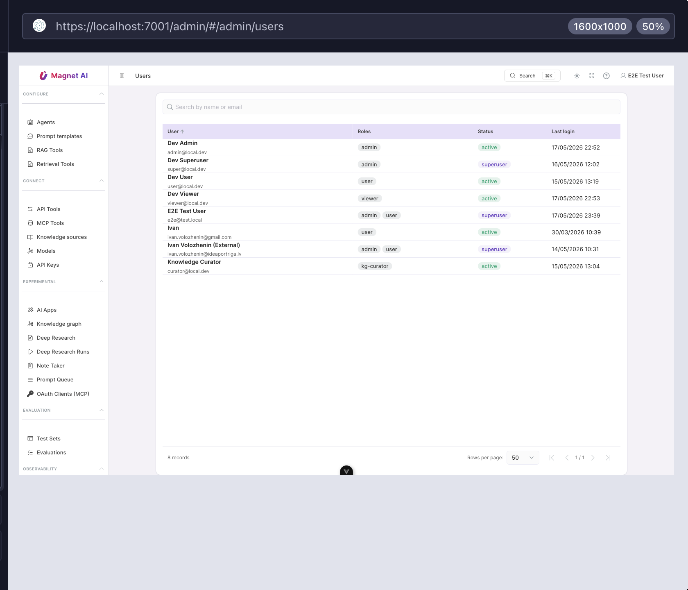

# Managing users

Open **System → Users** in the admin sidebar to see every user in your
tenant. The list shows name, email, roles, status (active, inactive,
superuser) and last login. Type in the search box to filter by name or
email.

::: tip Permissions
Listing users requires `read:users`. Editing role assignments requires
`manage:users`. Without `manage:users` the detail page is read-only
and a banner explains why.
:::

## User profile

Click any row to open the user's detail page. It shows:

- **Profile** — user ID, tenant ID, last login.
- **Roles** — every role available in the tenant. System roles
  (`admin`, `user`, `viewer`) appear first, marked with the `system`
  chip and a shield icon. Custom roles are below, marked `custom`.
  Each row also shows how many permissions the role grants.

Toggle the checkbox next to a role to stage an assignment or
revocation. A counter at the top of the panel shows how many roles
are pending add or remove. Press **Save** to commit; **Reset**
discards your pending changes.

::: warning Capability ceiling
You can only grant roles whose permissions you yourself hold (or any
role at all if you are a superuser). Trying to grant a role that
exceeds your own ceiling will be rejected with HTTP 403 and the page
will surface an error banner.
:::

## Creating users

User creation is not done from the admin UI on the alpha branch.
Users self-register through the public **Signup** page (if the
`local` auth provider is enabled) or arrive automatically the first
time they log in via an OAuth / OIDC provider that your deployment
trusts. After signup they have no roles and can see only their own
profile; an admin then opens the user and assigns roles.

In dev and CI the `api/scripts/seed_dev_fixtures.py` script creates
the standard set of test accounts (`super@`, `admin@`, `user@`,
`viewer@`, `curator@`). See the
[DevOps guide](../../devops/get-started) for details.

## Deactivating users

Set `is_active=false` on the user record to revoke access without
deleting the user. The user's history, ownership, and audit trail
stay intact, but every login attempt and existing session fails.
Re-enable later by flipping the flag back. Activation toggles ship
via the standard user-update endpoint; the admin UI button is on the
roadmap.

## Superusers

The **superuser** chip marks accounts that bypass every check —
including tenant isolation. Reserve this strictly for:

- The bootstrap account created by
  `bootstrap_superuser.py`.
- Platform operators who need to inspect or repair multiple tenants.

In production deployments the bootstrap account should be promoted to
a real tenant admin role and then have its `is_superuser` flag turned
off after the initial setup is done.

## Auditing changes

Every role assignment or revocation writes an entry to the
[Access log](./access-log) with the actor, the affected user, the
role IDs added or removed, and the request trace ID.
