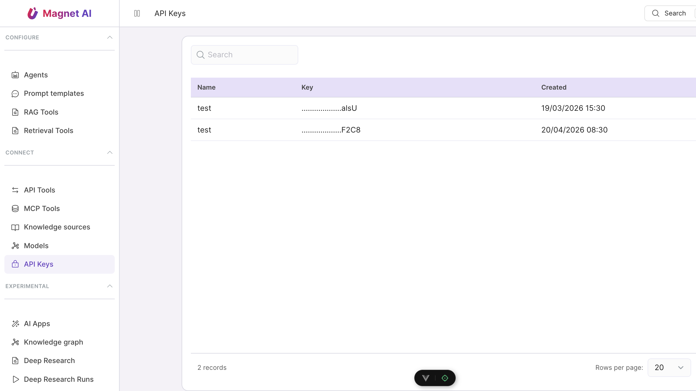

# API keys

API keys authenticate **backend-to-backend** integrations and
scripts that can't navigate the OAuth / cookie flow. Each key:

- Belongs to a single user (its "owner").
- Carries its own **scope list** — a subset of permission codes.
- Has an optional expiry.
- Cannot be retrieved after creation — only its hash is stored.

Manage keys at **System → API keys** in the admin sidebar.



::: tip Permissions
Listing keys requires `read:api_keys`. Creating, rotating, and
revoking keys requires `write:api_keys`. Scopes you assign to a
new key can never exceed your own current permission set.
:::

## Creating a key

1. Open **System → API keys** and press **New API key**.
2. Give it a descriptive **name** — pick something that will be
   readable in the audit log six months from now
   (`siebel-nightly-sync`, not `key-42`).
3. Optionally set an **expiration date**. Leave blank for
   "never" — but consider rotating annually.
4. Pick **scopes** — the same permission codes as roles. Grant
   only what the integration needs. The
   [permissions reference](../access/permissions-reference) lists
   every code.
5. Press **Create**.

The full key value is displayed **once**. Copy it into your
deployment's secret store immediately. After this dialog closes
the value is unrecoverable; the only path forward is to rotate.

## Using a key

Set the key as a `Bearer` token on every request:

```bash
curl https://magnet.example.com/api/agents \
  -H "Authorization: Bearer mk_live_<rest-of-the-key>"
```

The server identifies the key by its prefix, validates the SHA-256
hash against the stored value, and attaches the key's scopes as
the effective permission set on the request.

::: warning Capability ceiling, not role union
Unlike user sessions, API keys do **not** inherit the owning
user's role permissions. The scope list on the key is the
**complete** permission set — exactly what was checked at
creation time. This protects production keys from picking up
unintended privileges when the owner is later granted broader
rights.
:::

## Rotating

The detail page for each key offers **Rotate**, which issues a new
secret while preserving the key ID and scopes. The previous secret
is invalidated **immediately**. Schedule rotations during low-traffic
windows for keys that drive customer-facing flows.

## Revoking

**Delete** terminates the key. Any in-flight request authenticated
with it fails immediately with 401. The key's row stays in the
audit-log lineage so investigations can still resolve historic
events back to it.

## Best practices

- **One key per integration.** A shared key across many systems
  makes blast-radius cleanup painful when one of them is
  compromised.
- **Minimum scopes.** A nightly read of agent definitions doesn't
  need `write:*` or `delete:*`. The matrix in **New API key**
  groups by resource so it's easy to give read-only.
- **Rotate annually.** Even without a leak, scheduled rotation
  surfaces dead integrations (nobody noticed key X is no longer
  used) and limits the value of any captured key over time.
- **Store in a secret manager.** Vault, AWS Secrets Manager, K8s
  Secret with sealed encryption — not in source code, not in
  developer laptops.
- **Audit usage.** Every API request authenticated by a key
  carries the key ID on its access-log entry; filter by
  `actor_type=api_key` and the key's name to spot anomalies.
