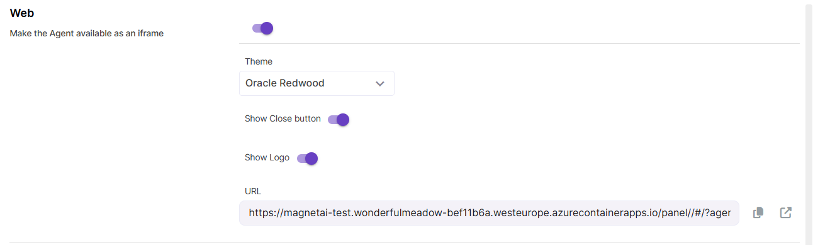

# Agent Channels

Agents created in Magnet AI can be delivered in end-users in many ways. The `Channels` tab enables admins to make their Agents available via web (as an iframe), MS Teams, or Slack.

##### Web channel

Enable this option to make Agent available by URL as an iframe.

Once the Web channel toggle is switched on, you can adjust UI settings like visual theme (currently Oracle Redwood and Salesforce styles are available), whether to display a Close button and a Magnet AI logo in the iframe.

Click the link icon to preview the Agent with its current settings in a new tab.

##### MS Teams

##### Slack
