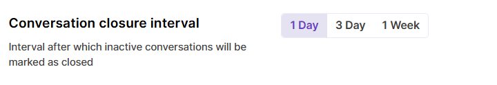
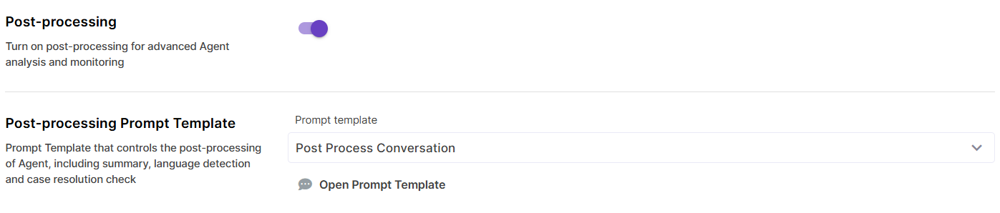
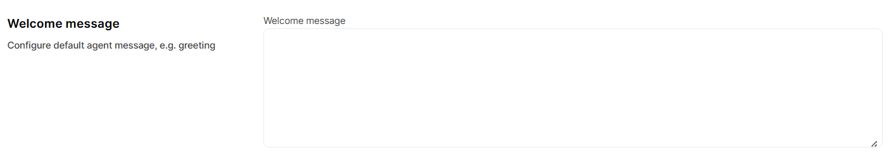
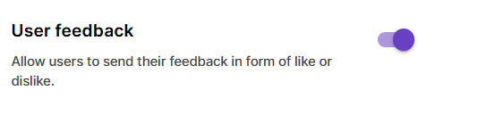
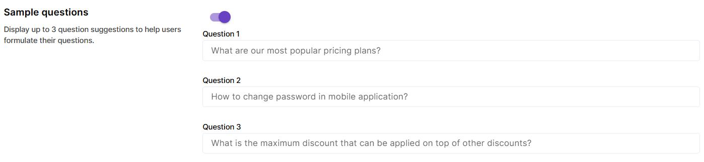

# Agent Configuration - Other settings

In this section, we will 

## Post-processing

#### Conversation closure interval

This parameter controls time period after which conversations with the Agent are automatically closed and post-processed. Default value is 1 day, but intervals of 3 days and 1 week are also available. Conversation closure and post-processing are handled by a regular job run.

#### Post-processing

Enable post-processing to collect metrics about conversations, like user sentiment, language, or resolution status. Metrics are generated with the help of a post-processing Prompt Template, for example `DEFAULT_AGENT_POST_PROCESSING`.

Post-processing is done on the conversation level. Message post-processing is not yet released.

## 

## UI Settings

#### Welcome message

A field to provide a default welcome message for the end-users. This message remains on UI and does not become a part of Agent's conversation (i.e. you will not be able to see it in Traces etc).

#### User feedback

Enable user feedback to collect likes and dislikes. For negative feedback, a comment can also be provided, so that Agent owners can analyze feedback. User likes and dislikes are included in Usage reports on both message and conversation level.

#### Sample questions

Provide up to 3 sample questions to help users start their first conversation with the Agent.

## 

## Channels

Please check the [Channels](./configuration-channels.md) page for detailed information on how to make your Agent available via various channels like web or messengers.

## Conversations

Under the Conversations tab, history of latest conversations with the Agent is stored. Please navigate to Usage or Traces for a comprehensive overview of Agent calls.

## Notes

Use this tab to store your notes and test inputs for the Agent.

## Test sets

Specific Test sets for evaluating Agents are not yet available, but you can choose a RAG or Prompt Template Test set here and use it for quick testing of specific Agent actions. 

To use this feature, select a Test Set from the dropdown and just click on a Test Set record to copy it into the user message field in Agent.
