# Agent Configuration

To add a new Agent, click on the “New” button under “Agents” section. Name your Agent and save it. 

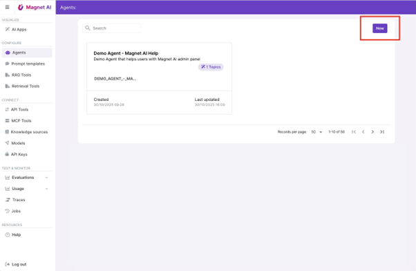

Now you will need to configure the Agent and equip it with the right tools (Actions).

Before you start the configuration, make sure you have read and understood [what Topics and Actions are](./topics-actions.md). 

Let's have a look at each of the tabs of the Agent configuration screen.

## Agent Topics Screen

##### Topic selection Prompt Template

Topic selection Prompt Template instructs the Agent how to detect Topics from user input. It can also contain instructions on how to handle cases when a Topic was not found or user intent does not classify as a Topic (some examples might be greetings or farewells).

This Prompt Template model used for this case must support JSON mode, since the LLM must respond with a certain JSON schema. 

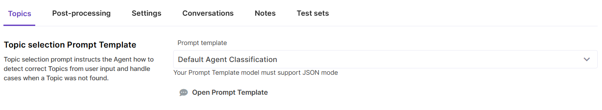

By clicking the "Open Prompt Template"  button, you will be navigated to the currently selected Prompt Template to view the instructions it provides.

Magnet AI is typically installed with a set of sample/default Prompt Templates. Check the `DEFAULT_AGENT_CLASSIFICATION` Prompt Template for default instructions and output schema.

If your Agent has only one Topic, we recommend using another Prompt Template for Topic selection: `DEFAULT_AGENT_CLASSIFICATION_PASS`. This is essentially a blank Prompt Template that allows to skip the topic selection step, which is not necessary for single-topic cases.

##### Agent topics

This section is an overview of all Topics that are available for the Agent. 

You can add new Topics and delete existing ones here. Click on a Topic name to view
its details in the Preview panel.

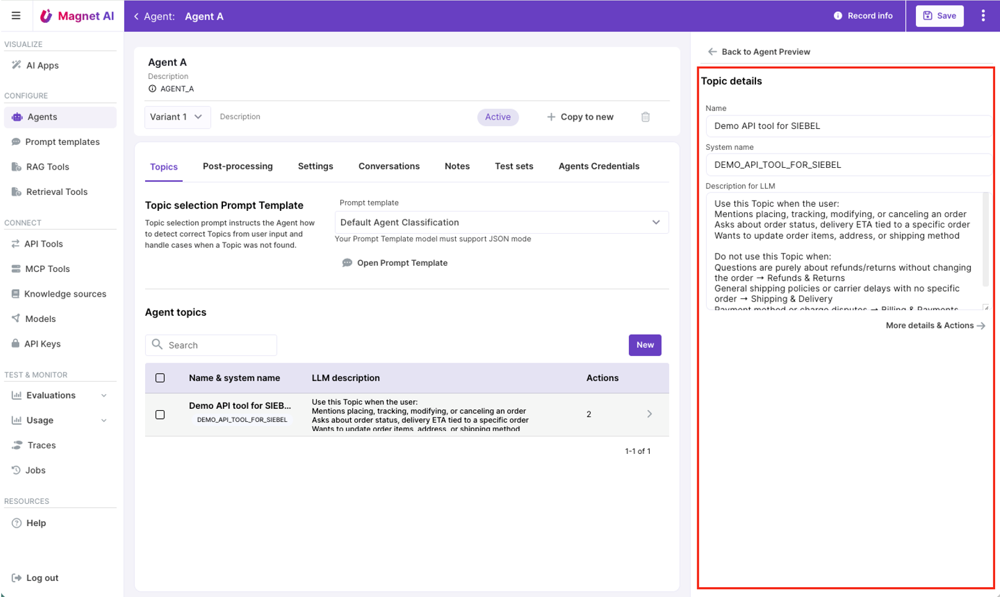

Make sure each of your Topics has an accurate and informative description for the LLM - it will be used to route the Agent. Provide instructions on cases when this Topic should be selected and what kind of questions users might be asking within this Topic.

By clicking on the arrow icon on a Topic record or the `More details & actions` button, you are navigated to the Topic details and Actions screen.

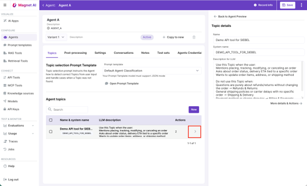

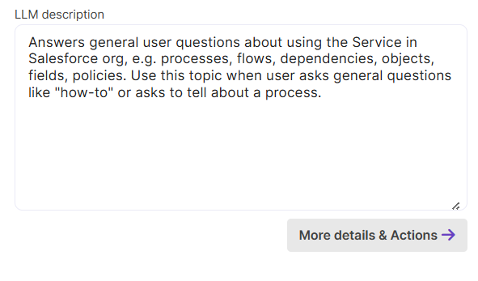

## 

## Topic Details & Actions screen

##### Topic Processing Prompt Template

This Prompt Template provides general instructions on how to process Topics once the Agent has selected one, primarily by calling relevant Actions (also known as tools). These instructions are applicable to the entire Agent. The LLM used for the Prompt Template must support tool calling.

By clicking the "Open Prompt Template" button, you will be navigated to the currently selected Prompt Template, so that you can view its instructions.

Check the `DEFAULT_AGENT_TOPIC_PROCESSING` Prompt Template in your Magnet AI instance for default instructions and output format.

##### Topic Advanced Instructions

In this section, you can optionally add extra instructions on how to process the current Topic. These instructions will be merged into Agent's Topic Processing Prompt inside the `{TOPIC_INSTRUCTIONS}` placeholder. This might help your Agent process the Topic more precisely and accurately.

If you have specific instructions applicable to all Actions inside a specific Topic, this is the right place to provide them.

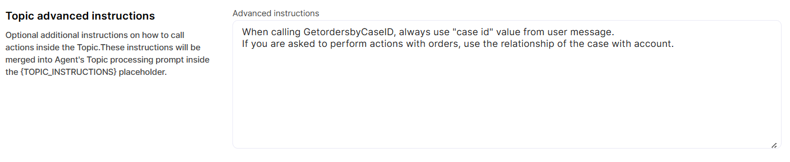

So, to recap, while your Topic Processing Prompt Template is applicable to all Topics within the Agent and provides general instructions on Topic processing, the Advanced Instructions field is applied to each Topic individually and adds extra instructions specific to this particular Topic.

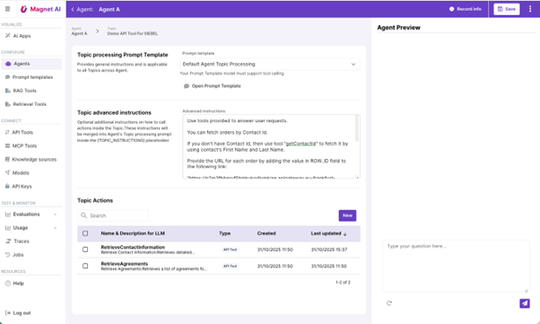

##### Topic Actions

This is the list of all Actions available under current Topic. Click on an Action to view its details in the Preview area.

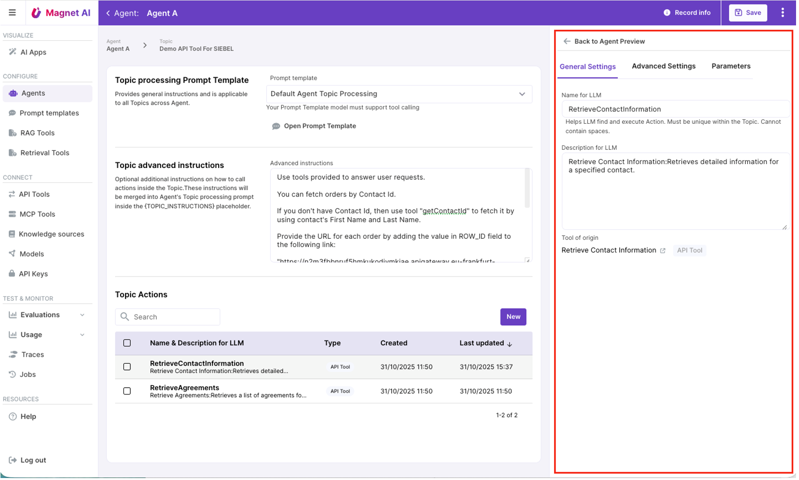

Let’s look deeply into the Action details.

###### General settings

- **Action LLM name** must be unique within the Topic and **cannot contain spaces
  **
  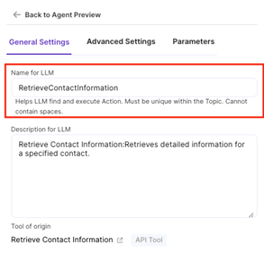

- **Description for the LLM** must provide accurate and sufficient information on what the Action does.
  
  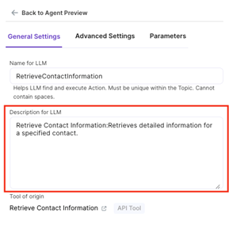

- **Tool of origin** is essentially the name and type of tool from which the action was originally created. This was you can check and/or edit the original tool properties (e.g. API Tool, RAG Tool, etc). You can drill down to the *Tool of origin* by clicking on the link icon near tool name. 
  
  

##### Advanced Settings

- **User Confirmation** setting enables human confirmation before the action is called. This is recommended for cases when data is updated or deleted by the Agent.
  
  This is an example of how confirmation form could look for the end user:
  
  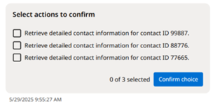
  
  **Custom action description** field (enabled if User Confirmation is on) provides the option to override default instructions on how Action description is presented to the end user. Namely, when user is prompted to confirm an action, they see a summary of what is going to happen. This summary is generated using default global instructions. If you need to re-shape it, use the Custom action description field.
  
  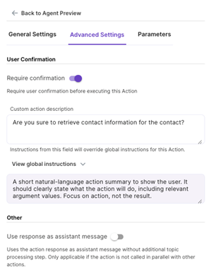

##### Parameters

Parameters tab provides an overview of Action parameters, if any. Actions that were created from API Tools and MCP Tools can have parameters. These are not editable on Action level, so if you need to tweak some parameter properties, you need to do it on the tool of origin.

Ideally all parameters should have descriptions, so that the LLM can look at these when calling Actions. While admins can add or edit parameter descriptions for API Tools, MCP Tool descriptions come from the MCP provider and cannot be changed.

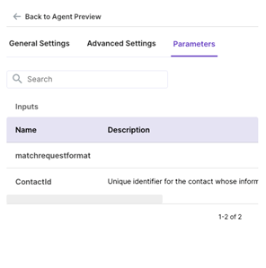
