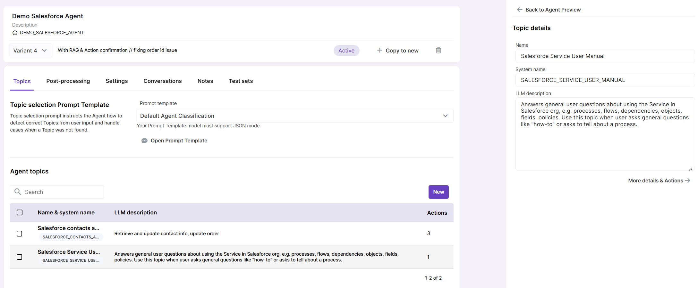
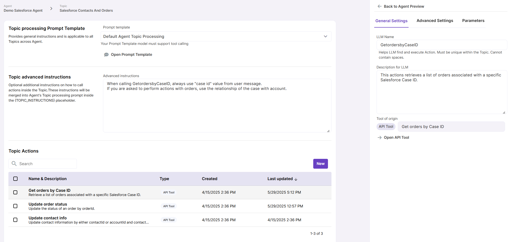
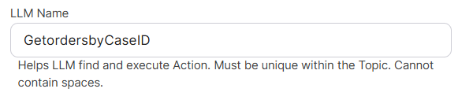
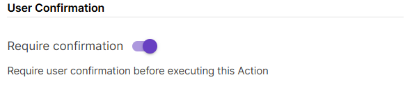
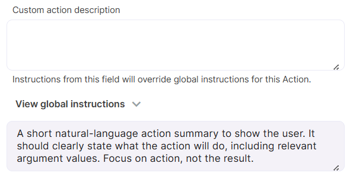
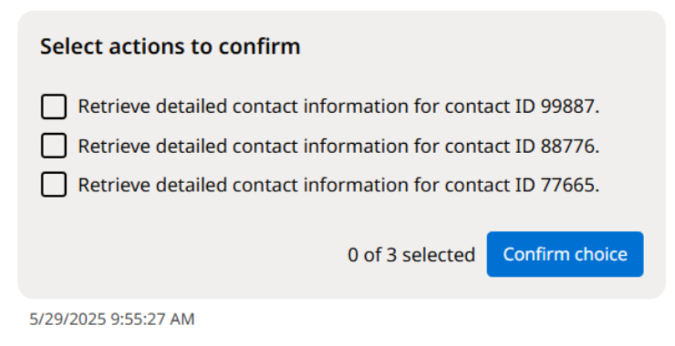
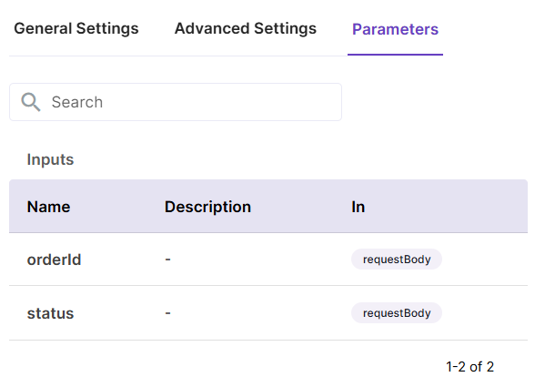

# Agent Configuration

Let's have a look at each of the tabs of the Agent configuration screen.

## Topics

##### Topic selection Prompt Template

Topic selection prompt instructs the Agent how to detect correct Topics from user input and handle cases when a Topic was not found. It also covers other types of user intent such as greeting, farewell, offtopic input etc.

This Prompt Template model must support JSON mode.

##### Agent topics

This is the list of all Topics that are available for the Agent. You can add new Topics and delete existing ones here. Click on a Topic name to view its details in the Preview panel.

Make sure each of your Topics has an accurate and informative description for the LLM. Provide instructions on cases when this Topic should be selected and what kind of questions users might be asking within this Topic.

Click the  `More details & Actions` button to drill down to Topic actions.

#### Topic processing Prompt Template

This template provides general instructions on how to process topics, primarily by calling relevant Actions (also known as tools). These instructions are are applicable to the entire Agent. The LLM used for the Prompt TEmplate must support tool calling.

#### Topic advanced instructions

Topic processing Prompt Template can be enriched with Topic-specific instructions. Use this field to provide additional instructions that are specific to current Topic.

#### Topic Actions

This is the list of all Actions available under current Topic. Click on an Action to view its details in the Preview area.

**Important**: 

- **Action LLM name** must be unique within the Topic and cannot contain spaces.
  
  

- **Description for the LLM** must provide accurate information about what the Action does.
  
  

- **User Confirmation** setting requires a human confirmation before the action is called. This is helpful for cases when data gets updated or deleted by the Agent.
  
  

- **Custom action description** field (enabled if User Confirmation is on) provides the option to override default instructions on how Action description is presented to the end user on UI. Namely, when user is prompted to confirm an action, they see a summary of that is going to happen. This summary is generated using degault global instructions. If you need to re-shape it, use the Custom action description field.
  
  
  
  

- **Parameters** tab provides an overview of actions parameters, if any. Applicable to Actions derived from API Tools. 
  
  

## Post-processing

#### Conversation closure interval

This parameter controls time period after which conversations with the Agent are automatically closed and post-processed. Default value is 1 day, but intervals of 3 days and 1 week are also available. Conversation closure and post-processing are handled by a regular job run. 

#### Post-processing

Enable post-processing to collect metrics about conversations, like user sentiment, language, or resolution status. Metrics are generated with the help of a post-processing Prompt Template.

Post-processing is done on the conversation level. Message post-processing is not yet released.

## UI Settings

#### Welcome message

A field to provide a default welcome message for the end-users.

#### User feedback

Enable user feedback to collect likes and dislikes. For negative feedback, a comment can also be provided, so that Agent owners can analyze feedback. User likes and dislikes are included in the Usage reports on both message and conversation level.

#### Sample questions

Provide up to 3 sample questions to help users start their first conversation with the Agent.

## Conversations

Under the Conversations tab, the history of past conversations with the Agent is stored. 

## Notes

Use this tab to store your notes and test inputs for the Agent.

## Test sets

Specific Test sets for evaluating Agents are not yet available, but you can choose a RAG or Prompt Template Test set here and use it for quick testing of specific Agent actions.
