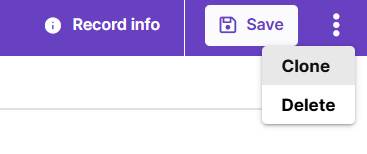
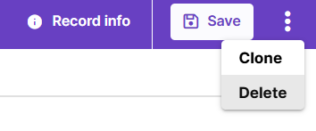

# Common tasks

You can clone, delete and preview most objects in Magnet AI. 

## Clone tools

To clone a tool, click the three dot icon in the top right corner of the screen (next to `Save` button) and select `Clone`. 

Cloning rather than directly editing is strongly recommended for [default Prompt Templates](/docs/en/admin/configure/prompt-templates/default.html) due to their specific structure. Clone a Prompt Template, modify the cloned record and use it. This way, you can easily switch back to original tool configuration if necessary without losing important details.

In other cases, it's up to you whether to clone a tool or create a new [variant](/docs/en/quickstarts/variants/using-variants.html). *Variants* typically share a lot in common, with some deviations, so that different setups can be tested and compared. *Cloning* is primarily used to take an existing tool configuration as a starting point and modify it to perform different tasks.

## Delete tools

Deleting records in Magnet AI cannot be undone. So, make sure you do not delete any records that you might need later. To prevent accidental deletion, a warning is displayed to the user before deletion. 

To delete a record, click the three-dot icon in the top right corner of the screen, next to the `Save` button, and select `Delete`. Then, confirm your action in the pop-up.

::: info

Some objects in Magnet AI have nested structure, and child records deleted on the UI do not actually get deleted before the `Save` button is hit on parent object.

Examples of such pattern include AI Apps (with AI Tabs under them) and Agents (with Topics and Actions). Deleting an AI Tab or a Topic/Action becomes irreversible once you hit the `Save` button on parent AI App or Agent.

:::

## Preview tools

You can preview most tools in Magnet AI in real time, without saving changes. Prompt Templates, RAG Tools, Retrieval Tools, Agents can be previewed in such way. 

Previewing AI Apps is slightly different. You will need to click the `Save` button to see changes related to child AI Tabs. However, if you change the AI App theme or other UI settings, you can immediately preview these changes.

::: info

Agent Conversations created through Preview area are not sent to the Usage reports.

:::

Preview in Knowledge Sources works as a semantic search - send your key word(s) or phrase and check the retrieved chunks and their scores to test how your Knowledge Source works.
