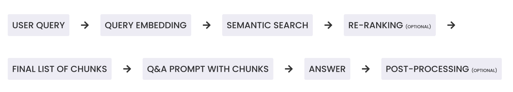

# RAG Tools

Most frequent use case for RAG Tool implementation is the Q&A functionality.

RAG tools answer user questions by embedding them into vector store, semantically searching for vectorized data ([hybrid search](/docs/en/admin/connect/knowledge-sources/settings.html#indexing-settings) can take place as well), retrieving relevant content and generating a response grounded in the retrieved data. 

### The RAG Pipeline

While this is quite a complicated pipeline, Magnet AI makes configuring RAG Tools simple yet flexible. We provide a range of default parameters that work well for most cases, so you actually just need to define a Knowledge Source to start. At the same time, you have full control over the parameters, which makes it easy to to tailor each step of the pipeline to your use case.

We'll have a deeper look into the RAG Tool configuration in the next chapter.
