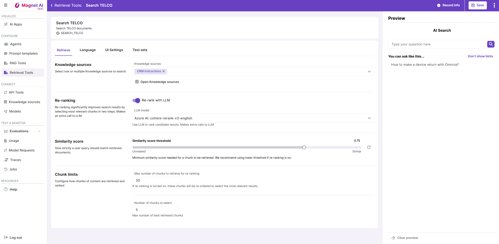

# Retrieval Tool Configuration

The Retrieval Tool configuration screen is split into several tabs, or sections. Since there are a lot of things in common with RAG Tools, we will refer to the [RAG Tool configuration process](/docs/en/admin/configure/rag-tools/configuration.html) and highlight the differences.

## Retrieve

The Retrieval configuration section for Retrieval Tools has almost the same set of parameters as that of RAG Tool, but `Number of added chunks` parameter is not applicable here, since Retrieval Tools only return links to chunks without generating text.

Re-ranking can be enabled for Retrieval Tools just like for RAG Tools.

::: info

There are no `Generate` parameters for Retrieval Tools since these do not generate any text.

:::

## Language

Multi-lingual Retrieval works in the same way as multi-lingual RAG: first, user language is detected with a prompt, then user input is translated into language of Knowledge Source. There is no need to translate response back to user message in the Retrieval pipeline, but the same [default translation Prompt Template](/docs/en/admin/configure/prompt-templates/default.html) can be used for input translation.

::: info

`Post-processing` is currently not available for Retrieval Tools.

:::

## UI settings

Retrieval Tool UI settings are the same as those of RAG Tools.

## Test sets

You can use test sets with type `RAG Tool` to test/preview your Retrieval Tools, so use this tab to reference a relevant Test set for quick access to sample inputs.
