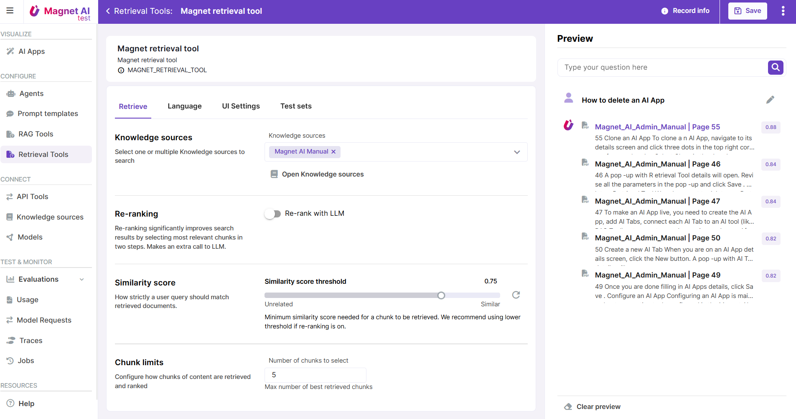

# Retrieval Tools

Retrieval Tools have a lot in common with RAG Tools, but rather than generating a text answer based on retrieved chunks of content, they only return links to relevant chunks.

The core use case for Retrieval Tools is semantic search for documents like instructions, manuals, or other technical documentation where original wording is critical, so we do not want the LLM to generate any additional text. This approach also works well for content that contains a lot of images, tables, or other elements that are challenging to parse. 

Retrieval tools answer user questions by embedding them into vector store, semantically searching for vectorized data ([hybrid search](/docs/en/admin/connect/knowledge-sources/settings.html#indexing-settings) can take place as well), retrieving relevant content and returning links to retrieved content.

Configuring Retrieval Tools is very similar to RAG Tools, but without the generation step. We'll have a deeper look into the Retrieval Tool configuration in the next chapter.

