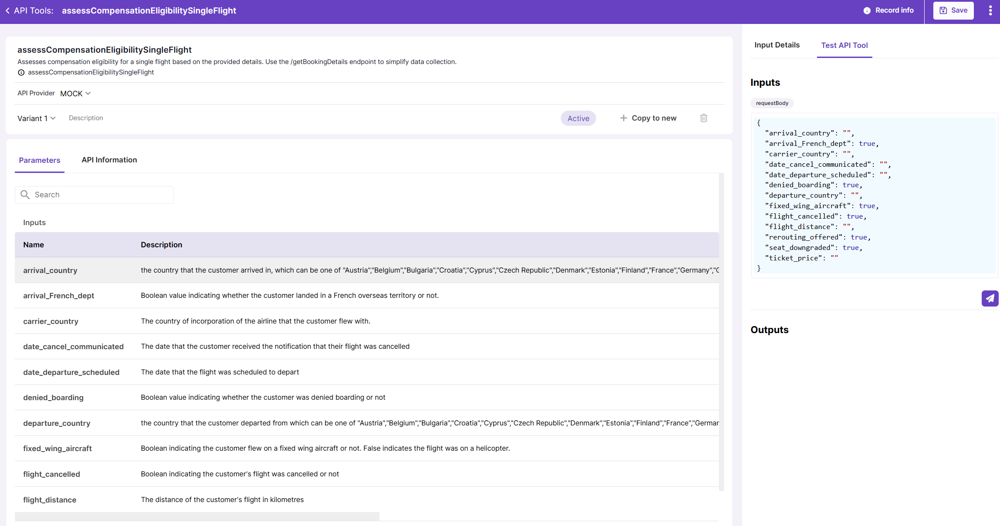

# API Tool Configuration

## Create a new API Tool

To add a new API Tool, upload your API specification in JSON or YAML format. Make sure that the file contains operation Ids as these will be used for API Tool creation, as well as operation descriptions and, ideally, parameter descriptions.

Before uploading your API spec you will need to select the API provider to which this API belongs. Currently the list of API providers is configured on the back and cannot be controlled from UI. 

At the next step, you will be prompted to select which operations you are willing to transform into API Tools. All detected operations are marked by default.

## Configuring an API Tool

Configuring API Tools involves adding descriptions for input parameters, if these are missing in initial specification. This is important because when API Tools are provided to Agents in form of Actions, the LLM needs to understand the purpose and structure of each API Tool in order to effectively process user queries.

Click on an input parameter on the API Tool details screen to view its details like name, description, type, format and enum values. You can adjust these values if necessary.  

Using the `API information` tab, you can also check API Tool definition in JSON format. It displays current definition, but there is also an option to view original definition generated from the uploaded spec file.

## Preview API Tool

Just as other tools in Magnet AI, API Tools can be tested before saving and using them in Agents.

Click the Test API Tool in the right panel of the screen to preview your API Tool. In some cases, example inputs are pre-populated to simplify testing. You can also paste your JSON with test inputs here. Click the `Send` button to test the API Tool response.

::: info

After you click `Save`, changes made to the API Tool are copied to Agent Actions that are using this tool, so make sure you preview and test your API Tool before saving it.

:::

