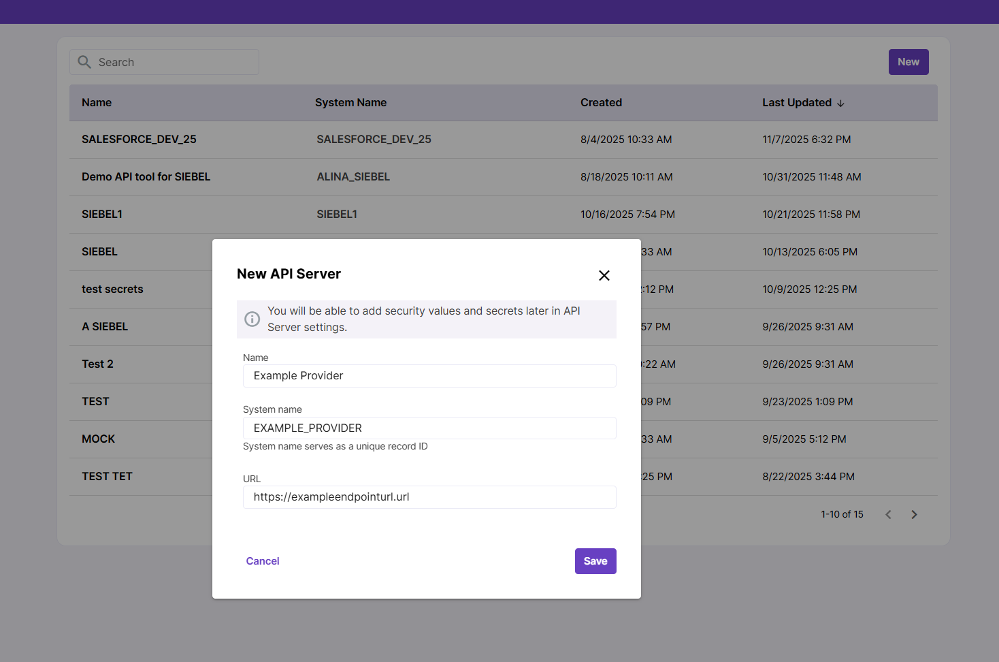
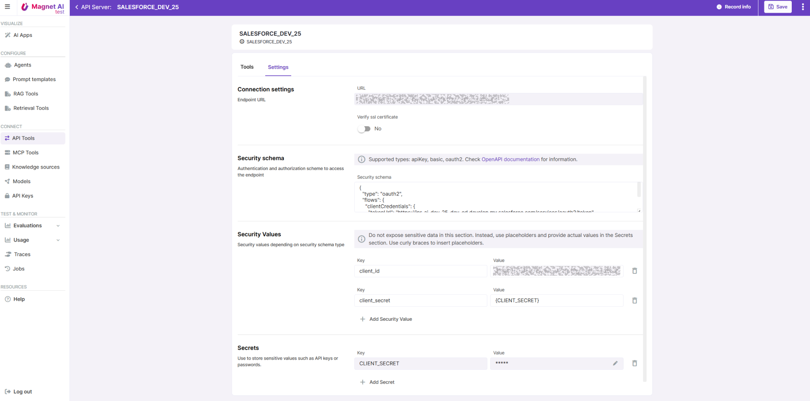
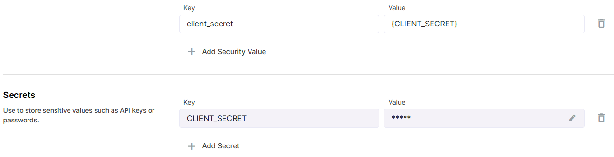
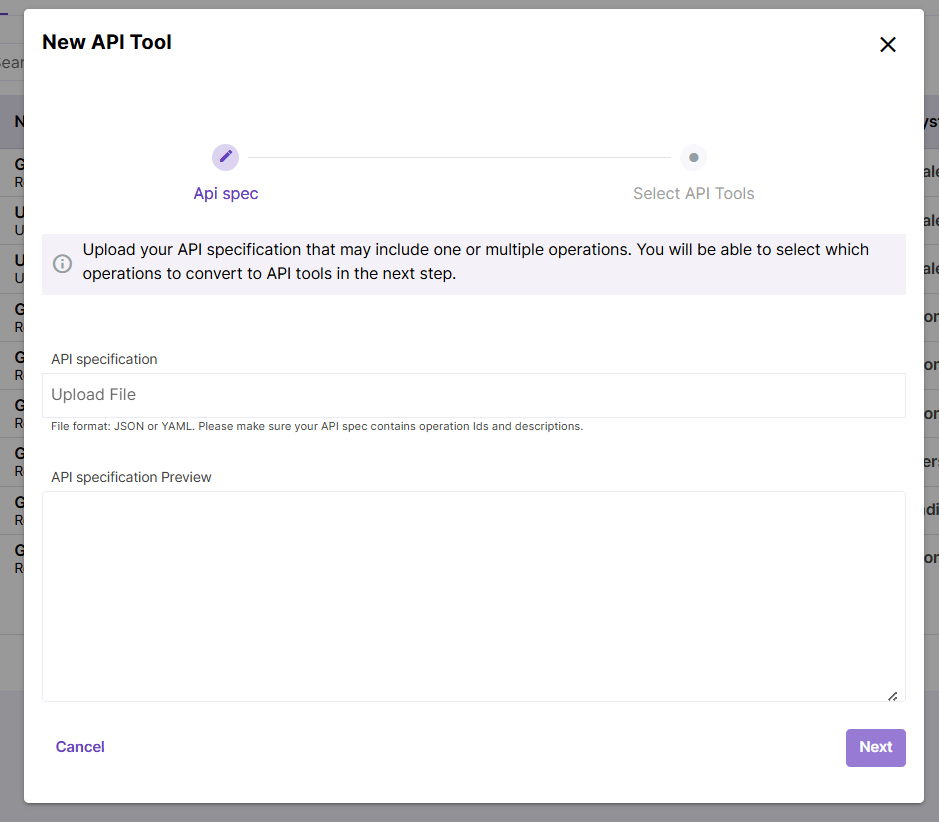
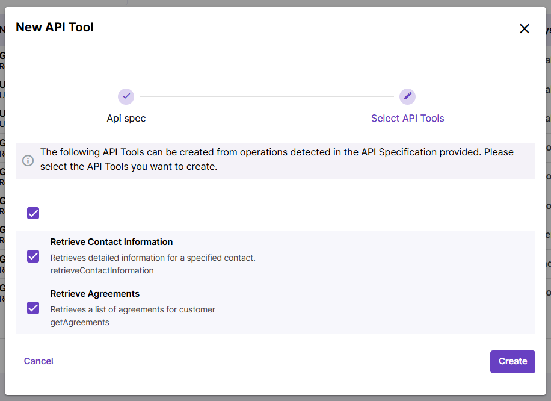
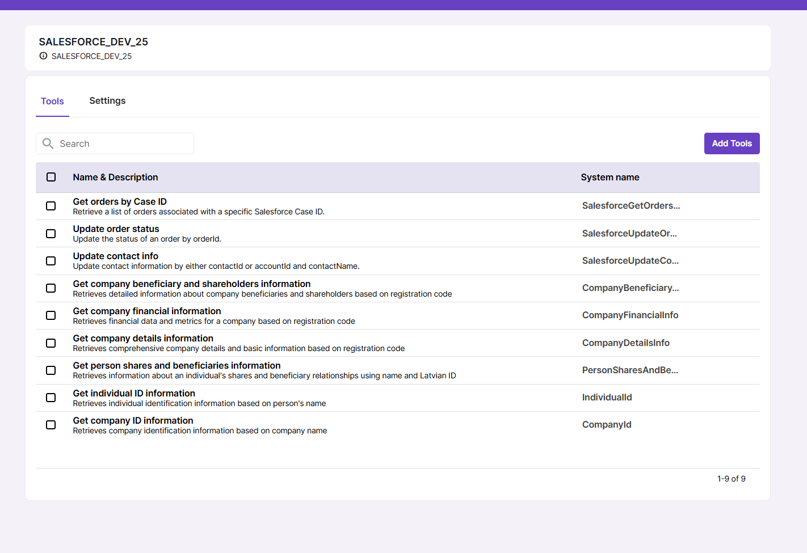
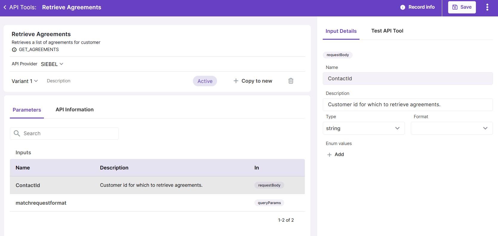
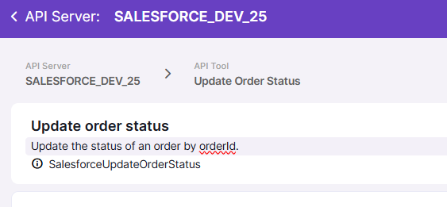
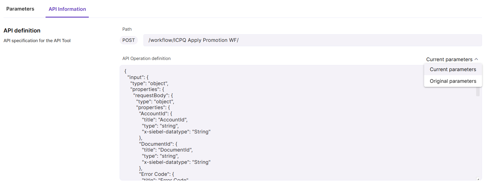
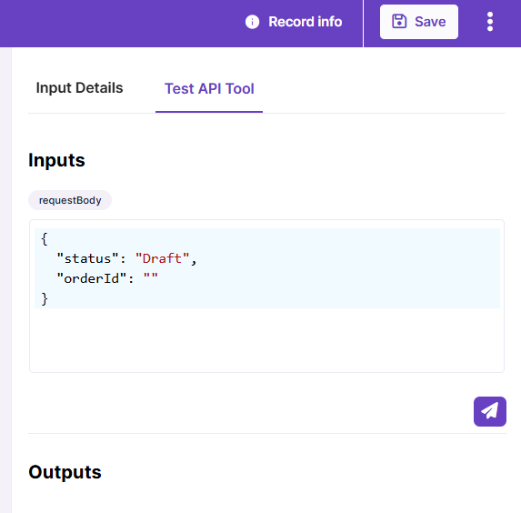

# API Tool Configuration

## Adding an API Provider

To add a new API Provider, navigate to API Tools in main navigation and click `New`.

You will be prompted to fill in API provider name (make sure it is informative and clear) and endpoint URL, which cannot be changed later.

## 

## API Provider settings

After creating your API provider, you will need to configure its connection settings.

Drill down to API Provider details screen and open the Settings tab.

Available settings are:

- Verify SSL certificate - yes/no

- Security schema for authorization. Supported types are API Key, Basic, and OAuth2.

- Security values - depending on security schema, use this section to store your security values like client ID or client secret. Please do not store secret values here. Instead, use placeholders with curly braces like `{PLACEHOLDER}` and store secrets in the `Secrets` section.

- Secrets is the right place to store sensitive values like API keys, passwords, and tokens. Secrets are encrypted and stored securely, so you will not be able to view them after saving.

## 

## Creating a new API Tool

Once you have your API Provider ready, you can add your API Tools. To do this, switch to the Tools tab in the API Provider details screen and click the `Add Tools` button.

Your API specification can be in JSON or YAML format and can include one or multiple operations. Make sure that the file contains operation Ids as these will be used for API Tool creation, as well as operation descriptions and, ideally, parameter descriptions.

At the next step, you will be prompted to select which operations you are willing to transform into API Tools. All detected operations are marked by default.

Click `Create` to finish adding your new API Tools.

Click `Save` to save your changes on the API Provider level.

The list of API Tools is now available under the `Tools` tab of the API Provider screen.

## Configuring an API Tool

To view and adjust an API Tool settings, click on an API Tool record. Configuring API Tools involves adding descriptions for input parameters, if these are missing in initial specification. This is important because when API Tools are provided to Agents in form of Actions, the LLM needs to understand the purpose and structure of each API Tool in order to effectively process user queries.

Click on an input parameter on the API Tool details screen to view its details like name, description, type, format and enum values. You can adjust these values if necessary.

Make sure your API Tool at least has a description. Description appears in tool header under tool title. This is important for the LLM to understand what each of the API Tools does when they are added to an Agent.

Input descriptions are recommended but not required.

API Tool parameter settings, such as enum values and descriptions, are copied into Agent Actions. If you update the parameters of an API Tool that is already used as an Action in an Agent, you may need to delete the existing Action and create a new one so the updated parameters are copied over.

The `API information` tab allows user to check API Tool definition in JSON format. It displays current definition, but there is also an option to view original definition generated from the uploaded spec file.

For testing purposes, you can also enable mock response by clicking the `Mock response` toggle under the API information tab.

## Previewing an API Tool

Just as other tools in Magnet AI, API Tools can be tested before using them in Agents.

To do so, click the `Test API Tool` tab in the sidebar panel. Provide required inputs (you can check what parameters are required in the API information tab), click the `Send` button, and wait for API response. 

Click the Test API Tool in the right panel of the screen to preview your API Tool. In some cases, example inputs are pre-populated to simplify testing. You can also paste your JSON with test inputs here. Click the `Send` button to test the API Tool response.
