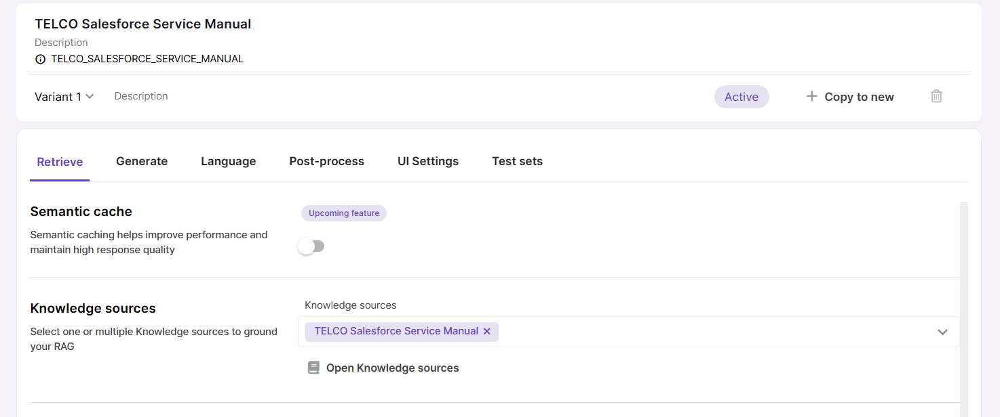
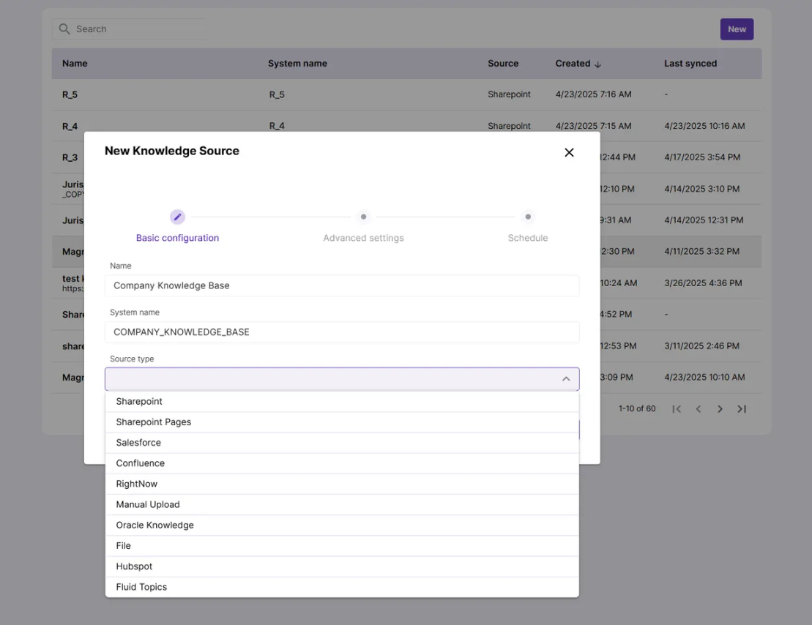

# Knowledge Sources

Knowledge Sources store your data in form of vector embeddings, enabling semantic search and grounding LLM responses in trusted, curated datasets.

Some use cases for vectorized data:

- **Semantic search** across similar records in a CRM, such as related support cases, emails, or customer interactions.

- **Question answering** based on internal documentation, manuals, or knowledge bases.

- **Context enrichment** for prompts by retrieving relevant context from stored embeddings.

## How Knowledge Sources work

To make your data available in Magnet AI, it must first be embedded into a vector store such as Cosmos DB or Oracle 23ai Database. This is where [embedding models](../models/overview.md) that you have previously deployed come into play - they transform your data into vector embeddings suitable for semantic search and retrieval.

Once you have your data embedded into a vector store, other Magnet AI tools like RAG or Retrieval tools can access it. To achieve this, you as an admin need to select the desired Knowledge Sources while configuring your tools.

Knowledge Source syncing (embedding new or updated data) can be done either manually or on schedule.

## Knowledge Source types currently supported in Magnet AI

- Sharepoint documents
- Sharepoint pages
- Salesforce Knowledge articles
- Oracle Knowledge
- PDF files (by URL)
- Hubspot content
- Confluence pages
- RightNow

Knowledge source types available for your organization depend on your setup and are configured on the backend. As an admin, you’ll see all configured types listed in the dropdown menu when creating a new Knowledge Source.

