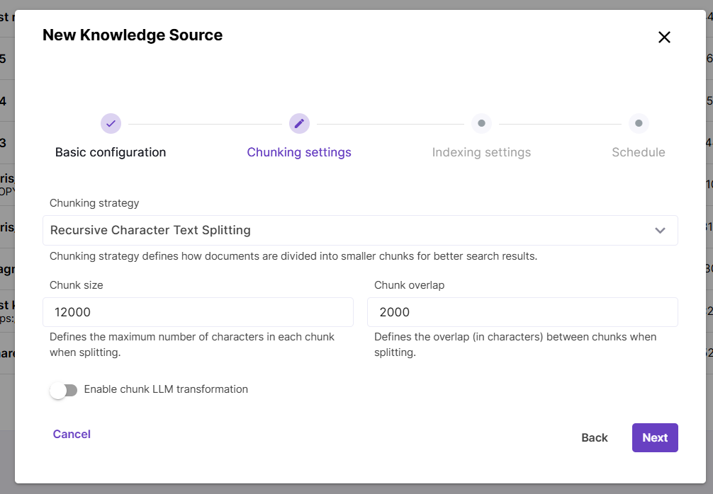
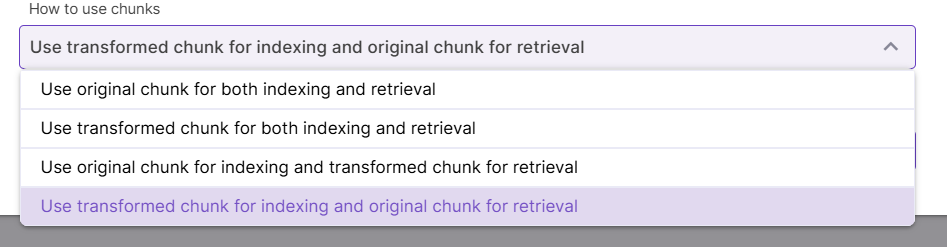
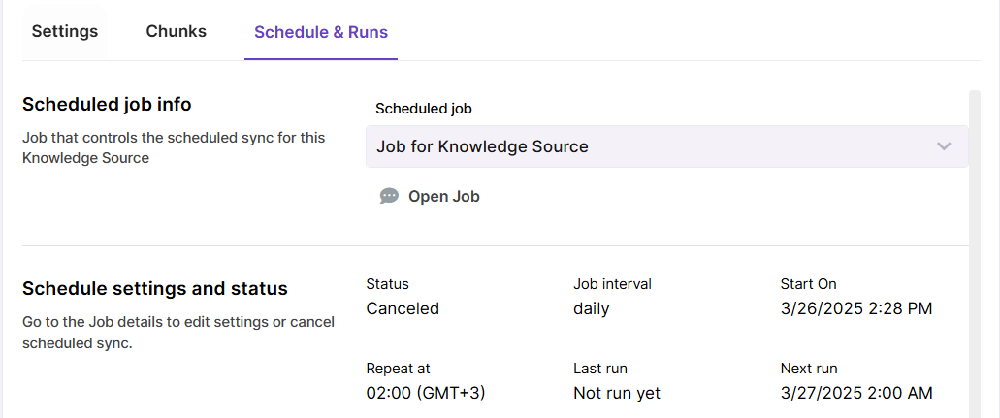

# Knowledge Source settings

Knowledge Source creation process is split into 4 steps:

- Basic configuration (depends on [type](types.md))

- Chunking settings

- Indexing settings

- Schedule

## Chunking settings

During the embedding process, content is split into chunks (pieces) to ensure better retrieval accuracy and performance.

The **Chunking strategy** parameter controls how documents are split into chunks. Currently Magnet AI supports the `Recursive Character Text Splitting` strategy, which recursively tries to split by different characters to find one that works. You can read more about this method [here]([RecursiveCharacterTextSplitter — 🦜🔗 LangChain documentation](https://python.langchain.com/api_reference/text_splitters/character/langchain_text_splitters.character.RecursiveCharacterTextSplitter.html)). For this strategy, two additional parameters are available: `Chunk size`, which defines the maximum number of characters in a chunk, and `Chunk overlap`, which defines how many characters from next and previous chunks are included in each chunk. This prevents losing context between pieces of content.

If you choose Chunking strategy `None`, content will be embedded into Knowledge Source without splitting.

**Chunk LLM transformation** is an advanced technique that can significantly improve search quality. However, it also requires many additional LLM calls and therefore increases cost and latency.

The first chunk transformation technique is called `Contextual Retrieval`. It improves Knowledge Source quality by adding explanatory context to each chunk, so that the LLM can know more precisely how one chunk relates to others. As the next setting, you can choose to either prepend, append this context to each chunk, or replace the chunk with generated transformation. Finally, choose how you want to use original and transformed chunks for indexing and retrieval.

The other transformation technique is based on `chunk summarization`. So, while Contextual retrieval helps LLM understand how one chunk relates to others, summarization simply adds a generic summary to each chunk or fully replaces it with a summary. Replacing chunks can be useful for cases when original chunks are large (e.g. a whole document has been embedded without chunking).

## Indexing settings

Indexing settings control how content is searched in the data store.

`Semantic search` is a core natural language processing capability that works well in many cases and enables document search based on the meaning rather than exact keyword match. ` If this type of search is enabled, an embedding model must be selected.

`Full-text search` searches for exact word or phrase matches without understanding the context.

These two types of search can be used independently or together. Enabling both semantic and full-text search allows to search semantically related content restricted by certain terms like metadata field values (**hybrid search**). For example, searching for installation instructions (semantic search) for a sertain equipment model (full-text search) could be a use case for hybrid search.

#### Things to know about hybrid search

- Full-text search capabilities depend on the underlying database configuration and may vary across different environments. If full-text search is not supported, it will be ignored during search.

- If both types of search are used, content chunk scores are merged and resulting scores are typically lower than those with just semantic search enabled.

- Semantic and full-text search are traced separately and score merging process is not displayed in tracing.

## Scheduling settings

- **Scheduled sync** regularly checks your content source for new, updated and deleted content and syncronizes changes with the vector store. Scheduled sync can be configured when creating a Knowledge Source, but you can also enable it for an existing Knowledge Source.

- Scheduled sync can be done hourly, daily and weekly.

- Error notifications for failed syncing jobs are currently an upcoming feature.

- You can view past sync runs in the `Schedule & Runs` tab of your Knowledge Source. If scheduled sync is enabled, there will be also a link to **Job** that runs the automated sync.

  
