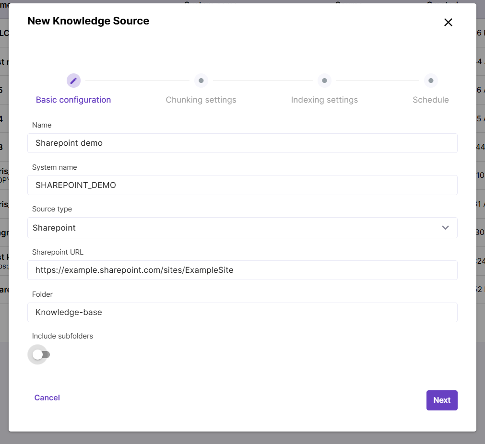
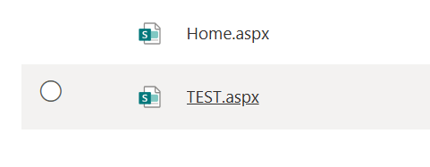
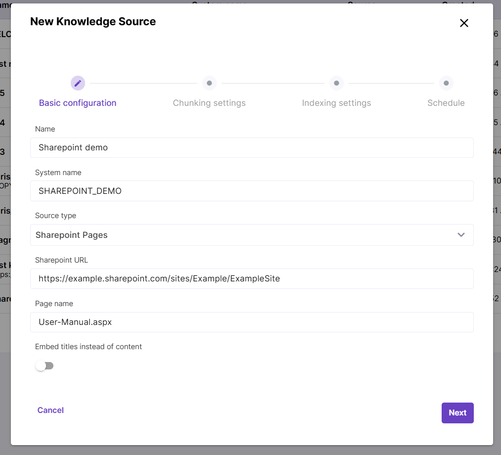

# Knowledge Source types

While parameters like chunking, indexing and syncing are common for all Knowledge Source types, some settings are specific to particular Knowledge Source type. Let's take a look at type-specific Knowledge Source settings.

## Sharepoint

Choose this source type if you need to sync **PDF documents** stored in a Sharepoint site or subsite. Provide the root site/subsite URL and, if you need to embed content of a particular folder, provide the path to desired folder. Trailing slash before the folder name is not needed, but you can use it in nested directories like Folder1/Folder2.

**Include subfolders** toggle adds content of all child folders inside current location.

## Sharepoint Pages

Choose this type to embed **web pages** stored in a Sharepoint site. Fill in the path to your Sharepoint site. 

There is also an option to embed just one web page. To do this, you need to paste your page name into the `Page name` field - both names with and without the `.aspx` suffix will work.

## Salesforce

Allows to embed Salesforce Knowledge content. You will need to provide the API name of object that needs to be embedded as well as output configuration. The output configuration should be structured as an array of strings, with each string corresponding to a distinct article type. For example: `["question: {Question__c}\\nanswer: {Answer__c}", "{Summary}"]`

## File

Works for PDF files that can be reached by URL. One or multiple files can be added to a Knowledge Source.

## Confluence

Embeds Confluence pages. Provide Confluence URL like `https://example.atlassian.net/` and space key that can be found under Space settings in your Confluence.

## Hubspot

UI to configure path to Hubspot content is an upcoming feature. Currently this path is configured on the backend. *
