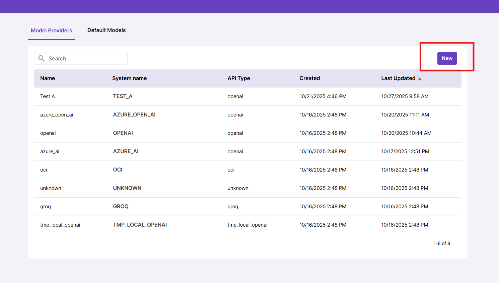
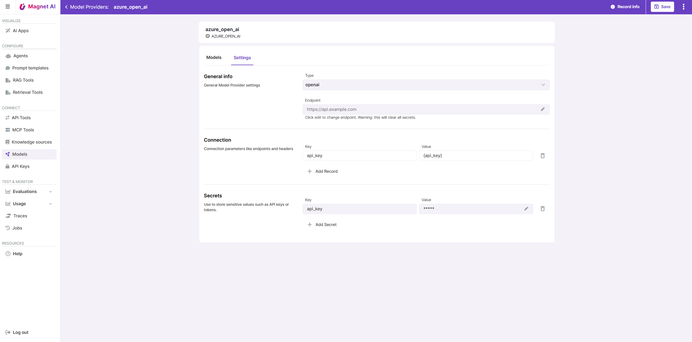
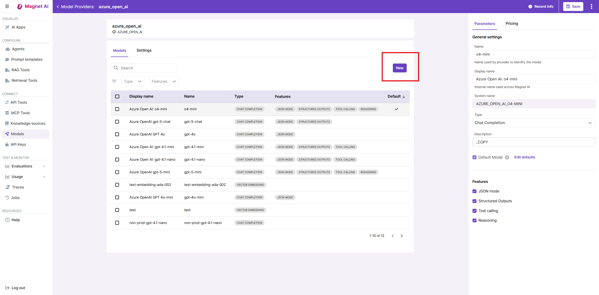
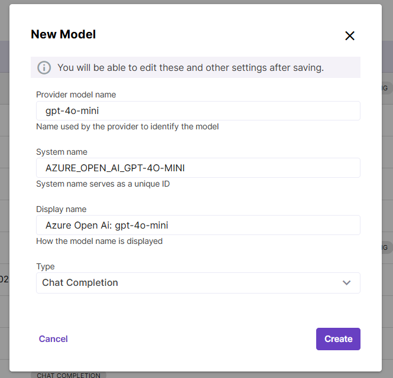

# Connecting models

To connect your models to Magnet AI, you first need to create Model Providers in Magnet AI and then add models under according providers.

## Adding a Model Provider

To add a Model Provider, navigate to Models in main navigation and click New.

You will be prompted to fill in your Model Provider name, API Type and Endpoint URL. Model Provider name is an internal name used in Magnet AI, but it is a good idea to make it clear and accurate (for example, Open AI or Azure Open AI), because it will be used as a default prefix for models created under this provider.

Depending on selected API Type, you will be prompted to fill in connection fields in the Settings tab of your Model Provider, so that Magnet AI can call your models added under this provider.

Make sure you store your secret values in the **Secrets** section so that are securely stored in encrypted format.

Note: If you happen to change the endpoint URL on an existing Model Provider, all secrets will get cleared.

## Adding a Model

Once you have at least one Model Provider in your Magnet AI instance, you can connect your models deployed with this provider. To do so, click on the Model Provider name to drill down to its details screen, and click New.

A pop-up window will open. Copy and paste your model delpoyment name (identifier) into the `Provider model name` field, e.g. `gpt-4o-mini`. This is an important step to ensure that connected models can be called from Magnet AI.

Display name field will be automatically populated from Model Provider name + Model name, but you can manually edit it if necessary.

Finally, select the model type/purpose: Chat completions, Vector embeddings, or Re-ranking.

