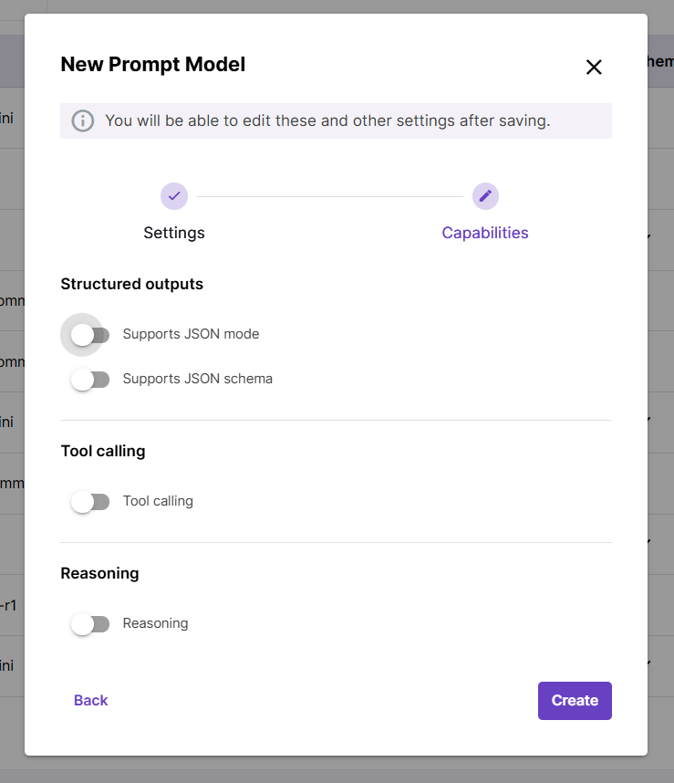

# Adding models

New models can be connected from the **Models** screen of the application. Open one of three tabs depending on the type of model you are adding: **Chat completion**, **Vector embedding**, or **Re-ranking**.

## Things to know about adding a new model

- Before adding a model, choose your **Provider** like Azure, Open AI, or OCI. It is also possible to add the same model hosted by different providers. For example, a model from your Azure environment and from Open AI can be connected as separate models.
  If you are on a Magnet AI demo playground, all providers and models [are already there](overview.md).

- **Display name** is the internal name of your model in Magnet AI application.

- For chat completion models, admins can configure capabilities like **JSON mode, Tool calling,** or **Reasoning**. This helps choose an LLM by its capabilities any time later, as you configure your tools. For example, only models with JSON mode support can be used for agent topic selection prompts.

- **Default** **model** means it is set by default for new Prompt Templates or Knowledge Sources to reduce configuration time. Typically it is a cost-effective and versatile model like `gpt 4o-mini` that works well in many scenarios. It is up to the admin which model is set as default one.
  
  
