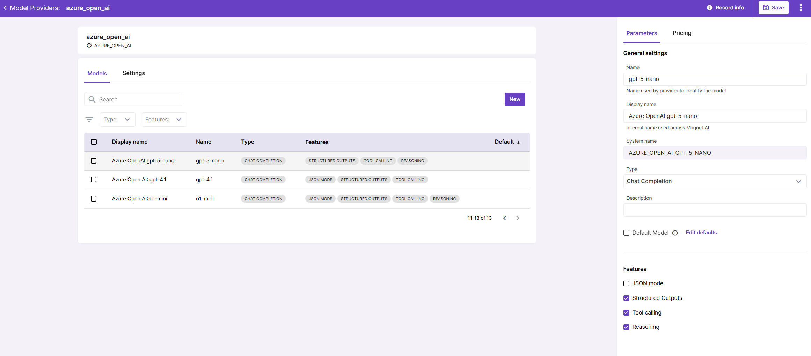
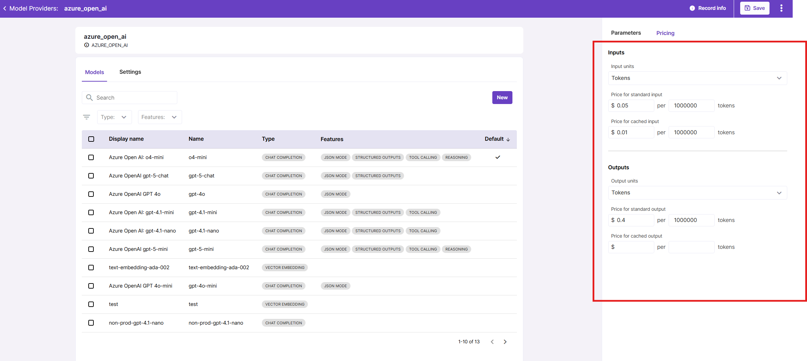

# Model Configuration

Click on a model name in the model list to view its details in the sidebar panel.

## Model Features

Model features are capablities supported by particular model. Currently these fatures are:

- JSON mode

- Structured Outputs

- Tool Calling

- Reasoning.

Once you have connected a model, make sure you tick the checkboxes for features supported by the model. This information will be used across the application - for example, JSON Schema field will be available only for those models that support Structured Outputs.

## Model Pricing

Model pricing information is important because it is used to calculate LLM call costs in reports and [dashboards](../../../quickstarts/usage-dashboards/overview.md).

Pricing information is stored in Model details under the Pricing tab.

Refer to Model Provider’s pricing documentation for correct values and units of measure (e.g. tokens or queries).

