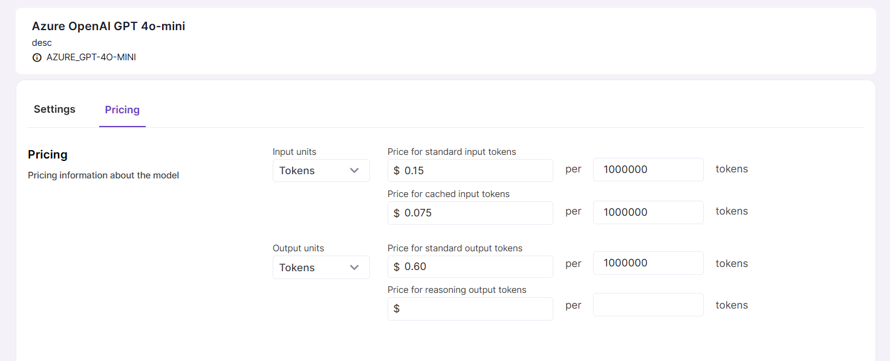

# Model Pricing

Model pricing information is important because it is used to calculate LLM call costs in reports and [dashboards](../../../quickstarts/usage-dashboards/overview.md).

Once you have added a model, it is a good idea to drill down to its details and fill in its pricing details. Keep in mind that pricing can vary depending on model provider, so refer to provider’s pricing documentation for correct values and units of measure (e.g. tokens or queries). 

Pricing information is stored in Model details under the Pricing tab.

> If you are using **Magnet AI demo playground**, LLM pricing data is already configured.

