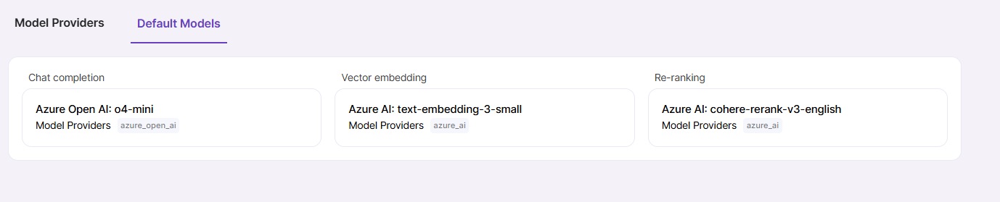

# Models

Magnet AI provides the UI to easily connect models for chat completion, vector embedding, and re-ranking. 

To connect models, you need admin access to the environment where your models are deployed. First, you will need to add your Model providers in Magnet AI (e.g. Azure Open AI, Open AI, etc) and second, connect models that you have deployed with your provider and want to make available in Magnet AI.

To use Magnet AI, you will essentially need at least one chat completion model for Prompt Templates to work and an embedding model to enable semantic search. In practice, you will need more models to choose from, so that you can optimize your tool performance and cost-effectiveness for different use cases.

Make sure you configure features (capabilities) and pricing for your models, so that call costs are calculated accurately.

## Default Models

Navigate to the Default Models tab to select models which will be used by default across the application. For example, when you create a blank Prompt Template, default chat completion model will be used. For newly created Knowledge Sources, default embedding model will be used, unless you change it during Knowledge Source creation.

You can change default model by clicking pencil icon next to its heading and selecting a different model from the dropdown. This action will not affect existing records where a model has already been set.

