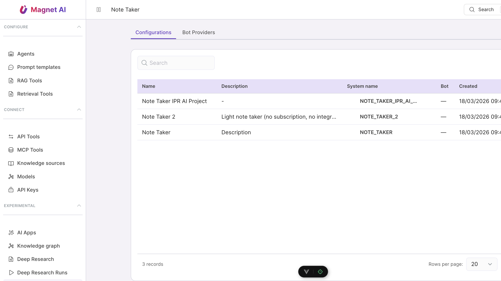

# Note Taker

The **Note Taker** captures meetings — primarily from Microsoft
Teams via a webhook → STT (speech-to-text) → integrations
pipeline — and turns them into searchable transcripts,
summaries, and downstream actions inside Magnet.

::: tip Permissions
Listing and reading transcripts requires `read:note_taker`.
Uploading, editing, and changing settings requires
`write:note_taker`. Both are granted to the system `user` role
out of the box.
:::

## How a recording becomes a transcript

1. **Webhook ingest.** Teams (or another configured provider)
   posts a "meeting ended" event to Magnet. The event lands on
   the `teams_webhook_event` table, where a housekeeping job
   trims rows older than the retention window.
2. **Job enqueue.** A taskiq task picks the event up and creates
   a `note_taker_jobs` row.
3. **STT.** The configured transcription backend processes the
   recording. Failures retry durably through
   `taskiq.schedule_by_time` so transient backend hiccups don't
   drop meetings.
4. **Post-processing.** Configured prompt templates run over the
   transcript — summary, action items, follow-up emails, etc.
5. **Integrations.** Outbound integrations (CRM updates, Slack
   messages, follow-up emails) fire from the post-processed
   result. Each attempt is recorded in
   `note_taker_integration_attempt` for audit and retry.

Each step is observable through the `notetaker.running_jobs`
gauge in Grafana, and per-meeting trace IDs link rows in the
admin UI to the underlying request logs.

## Configuration

Each Note Taker configuration record has its own tab set:

- **General** — display name, system name, owner, visibility.
- **Bot** — which meeting bot account joins meetings on Magnet's
  behalf, calendar / availability rules.
- **MS Teams** — webhook URL and shared secret used to validate
  incoming events. Pair this with the Teams admin steps below.
- **Transcription** — STT backend (provider, language, vocabulary
  hints), token and quality settings.
- **Post-processing** — prompt templates that fan out over the
  transcript. Reuses the existing
  [Prompt Templates](../configure/prompt-templates/overview)
  catalog.
- **Embedding** — whether transcripts are embedded into the
  knowledge graph for downstream search and RAG.
- **Prompts** — quick-edit shortcuts for the post-processing
  prompts.
- **Integrations** — outbound webhooks / API calls fired after
  post-processing.

Save the record to apply changes; the worker process reloads its
configuration without needing a restart.

## Teams setup

To receive Teams meetings:

1. Register an **Azure Bot Service** identity with Microsoft.
2. Create an **Azure AD application** with the required Graph
   delegated permissions
   (`OnlineMeetings.Read.All`, `OnlineMeetingRecording.Read.All`).
3. Subscribe to **Graph change notifications** for
   `/communications/onlineMeetings/getAllRecordings` pointing at
   Magnet's webhook URL.
4. Paste the application's tenant ID, client ID, and the webhook
   shared secret into the **MS Teams** tab.
5. Use the **Test connection** button to fire a synthetic event;
   it should appear under the meeting list within seconds.

## Reliability features

Three changes in the alpha hardened the pipeline against the
common failure modes:

- **Durable retries** — the previous APScheduler-based retry
  loop was non-idempotent under crashes. Taskiq's
  `schedule_by_time` persists the retry intent in the broker, so
  a worker restart re-picks the pending job.
- **Webhook event housekeeping** — a cron job
  (`cleanup_teams_webhook_events`) trims rows older than the
  configured retention to keep ingest latency low and prevent
  unbounded growth.
- **Observable gauge** — `notetaker.running_jobs` shows the
  currently-running jobs per stage. Pair with the Grafana
  dashboard under `dashboards/notetaker-pipeline.json`.

## Manual jobs

Operators with `write:note_taker` can:

- **Re-run post-processing** on a transcript without touching
  STT — useful after editing a prompt template.
- **Retry integrations** that previously failed; each attempt
  rows are visible from the meeting detail page.
- **Delete a transcript** — soft delete sets the row inactive but
  preserves the audit trail and integration attempt history.

## Audit and observability

Each meeting carries:

- Created-at + completed-at timestamps.
- Owner — the user the bot joined on behalf of.
- The set of post-processing prompts that ran.
- The list of integration attempts with status (`ok`,
  `retrying`, `failed`).

Failed integrations write structured errors to the standard
[logging stack](../../developers/guides/logging) with the
meeting trace ID — query
`{application="magnet-ai", logger="note_taker"} |= "<trace_id>"`
in Loki to reconstruct the failure.
