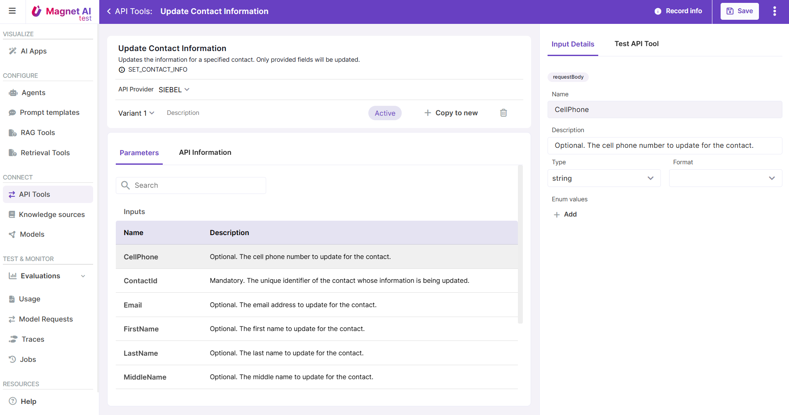

# API Tools

## How API Tools work

API Tools enable Agents to interact with external systems, which gives Agents really broad abilities to query and modify external data in order to solve end-user problems. While Agents can also use RAG Tools or Prompt Templates as tools, API Tools is what really empowers the Agents and makes the most of the function calling ability.

API Tools typically have parameters that can be described for the LLM. Parameters are populated during conversation (e.g. from current context or from user inputs) and passed on to the according function.

## Steps to Configure an API Tool

Configuring an API Tool includes 7 steps:

1. Upload API specification, which may include one or multiple operations. Should be a yaml or json file.

2. Select operations that you want to convert to API Tools.

3. If your original specification file missed parameter descriptions and other info about them, fill these in to help the LLM understand your API Tools.

4. Preview your API Tools to check how they work.

Read more about configuring API Tools.
