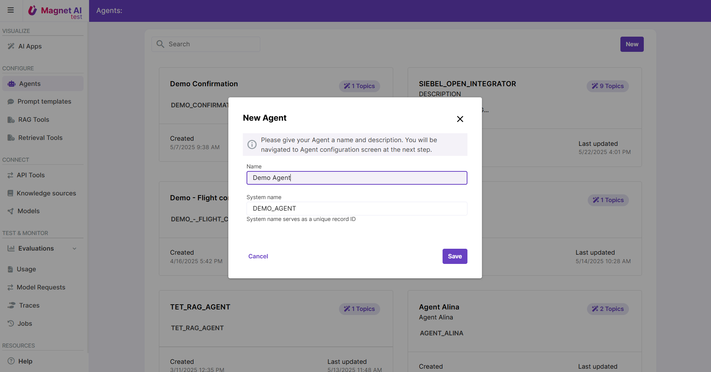

# Steps to configure an Agent

Configuring an Agent includes 8 major steps:

1. Add your first Topic and provide a Topic description for the LLM to understand when this Topic should be selected.

2. Add Actions inside your Topic. API Tools, RAG Tools, Rerieval Tools, and Prompt Templates can be provided as Agent Actions. Make sure each of the Actions has a name and description for the LLM.

3. Iterate on these two steps depending on how many Topics you need to add.

4. Review the Topic Selection Prompt Template _(optional)_. Default Prompt Template should work well as a starting point, but it can be replaced if necessary. Use Agent Preview to understand areas for improvement.

5. Review the Topic Processing Prompt Template _(optional)_.

6. Enable Post-processing to collect metrics like case resolution or user sentiment _(optional)_.

7. Adjust UI settings like user feedback or welcome message _(optional)_.

8. Preview your Agent and save it.

[Read more](../../../en/admin/configure/agents/configuration-topics.md) about configuring an Agent.

