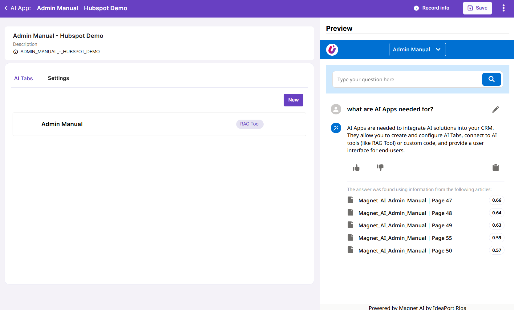

# AI Apps

AI Apps provide the fastest way to deliver AI features configured in Magnet AI to end users. These are UI components that allow admins to assemble AI features together in a no-code way.

Out of the box, AI Apps support two design styles: Salesforce and Oracle Redwood. AI Apps support two levels of navigation, making it easy to organize and display multiple AI tools even within a compact UI panel.

