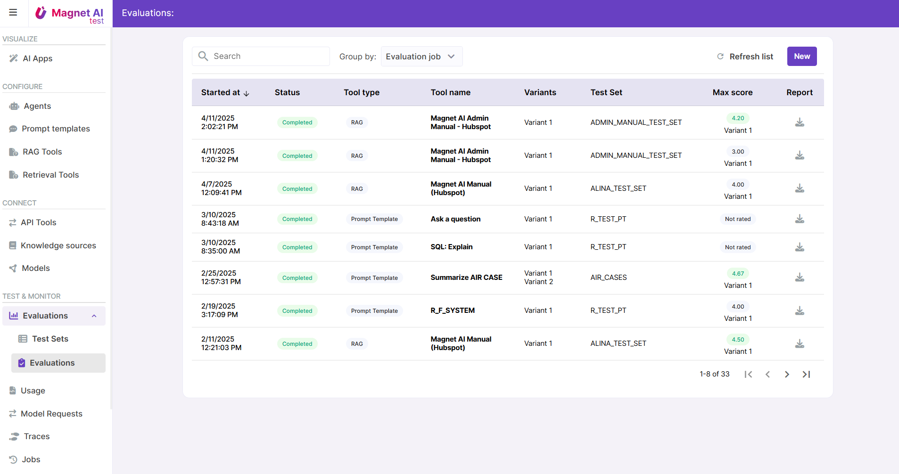

# Evaluations

Once an AI feature is configured, we need to understand whether it is accurate, safe, and predictable enough. Evaluations help understand this by testing with a large number of example tasks and comparing LLM-generated output to expected output.

Evaluation can be done by:

- **Humans** (rate answers, check response quality)
- **Automated tools** (use the LLM-as-a-judge technique or rules for assessment)

Currently only human evaluation is supported by Magnet AI, with automated scoring planned for future release. Evaluations are supported for [Prompt Templates](../prompt-templates/overview.md) and [RAG Tools](../rag-tools/overview.md).

Evaluations also allow to compare results for multiple variants of same tool, so that the best-performing variant can be identified.

Evaluation results can be exported in .csv format.

