# Building a Q&A Agent: step-by-step instructions

## 1. Set up a Knowledge Source

Create a Knowledge Source. [Learn more](../../../admin/connect/knowledge-sources/types.md) about adding Knowledge Sources depending on your content storage type. In this example, we’ll use the `Magnet AI Admin Manual - HS` as the knowledge source.

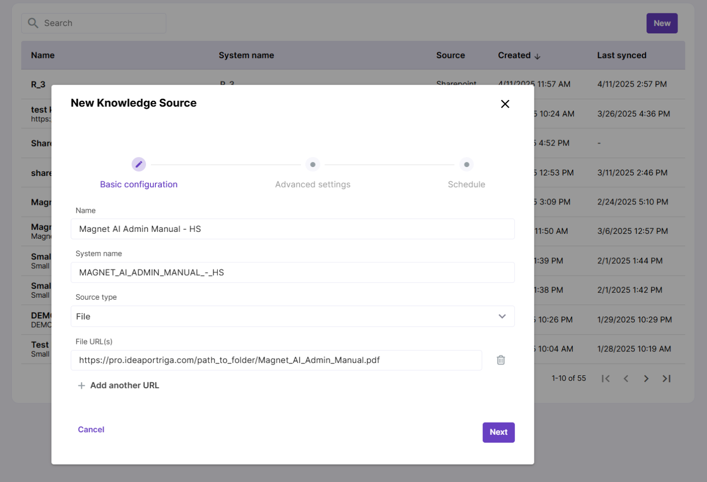

## 2. Create a RAG Tool

Set up a new RAG Tool. Select your Knowledge Source and enable Post-processing and user feedback to track RAG performance.

For the first run, you can stick with the default settings for Retrieve and Generate parameters. [Learn more](../../../admin/configure/rag-tools/configuration.md) about configuring RAG Tools.

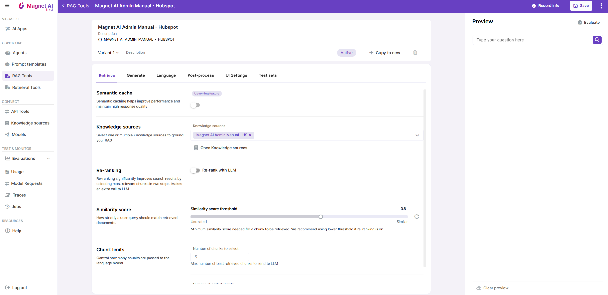

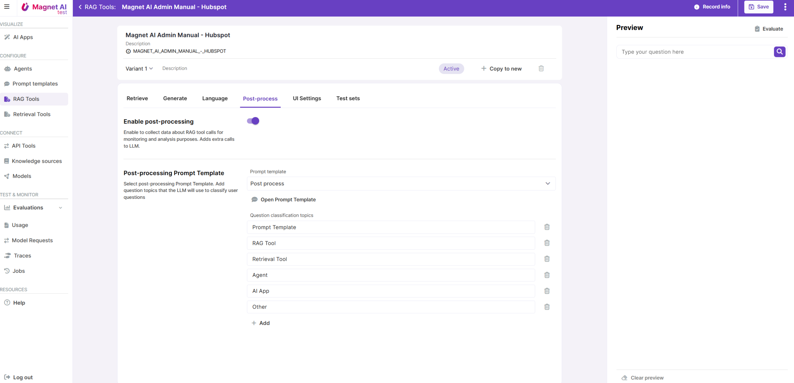

## 3. Preview and save your RAG Tool

Preview your RAG Tool in the Preview panel. Try creating multiple variants to compare different configuration options and see what works best. Save your RAG Tool.

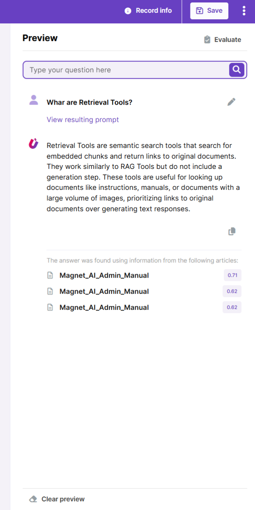

## 4. Run Evaluation

Optionally - you can do an Evaluation of your RAG Tool to make sure its quality and consistency of responses is acceptable.

First, make sure you’ve created a `Test Set` with sample inputs. Then, from the RAG Tool details screen, click the **Evaluate** button and fill in the necessary fields.

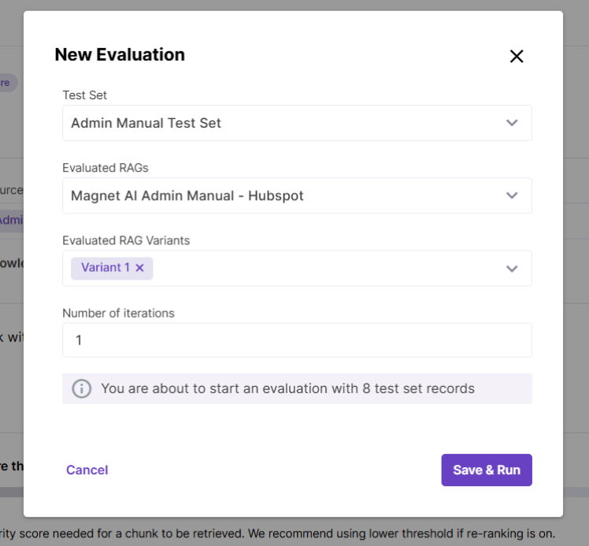

Save and run the Evaluation and go to the Evaluations screen to track its progress. Once its status is `Completed`, review the evaluation records and score them. If needed, go back to your RAG tool and make improvements.

You can also evaluate multiple variants of the same tool to find the one that performs best.

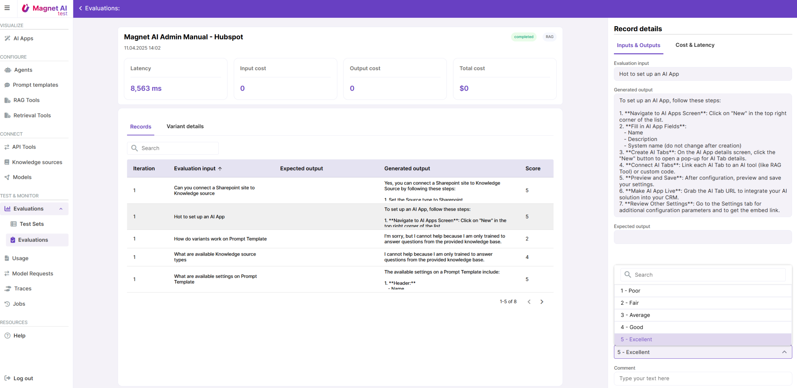

## 5. Create the Agent

It’s time to build the Agent! Create a new one and add a new Topic to it - make sure to give the Topic a clear name and description to help the LLM understand that it should be used for answering user questions about using the Magnet AI app from an admin’s perspective.

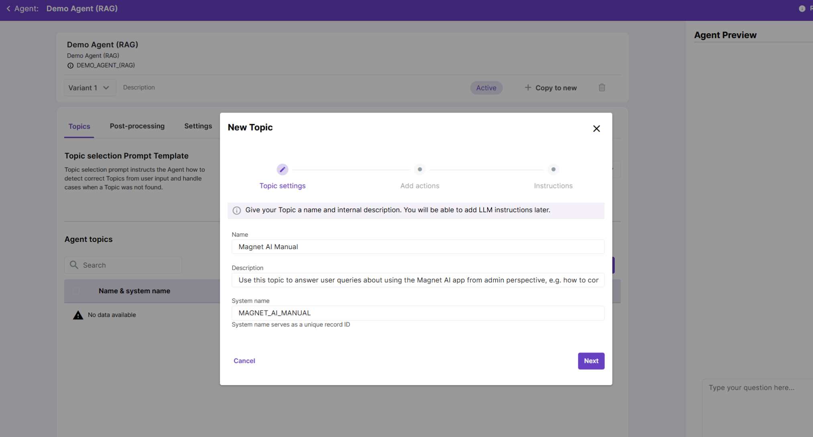

## 6. Add your RAG Tool to the Agent

Now, we need to equip our Agent with the RAG Tool, so that the Agent can use it to answer user queries. After you’ve given your Topic a name and description, add the RAG Tool you’ve just created to the list of Actions.

You can skip the Instructions step at this moment.

Don’t forget to update LLM description for your Action. Since we only have one Topic and one Action in this example, Topic and Action descriptions can be pretty much the same. But with more complex Agents, description is crucial for the model to choose the best trajectory.

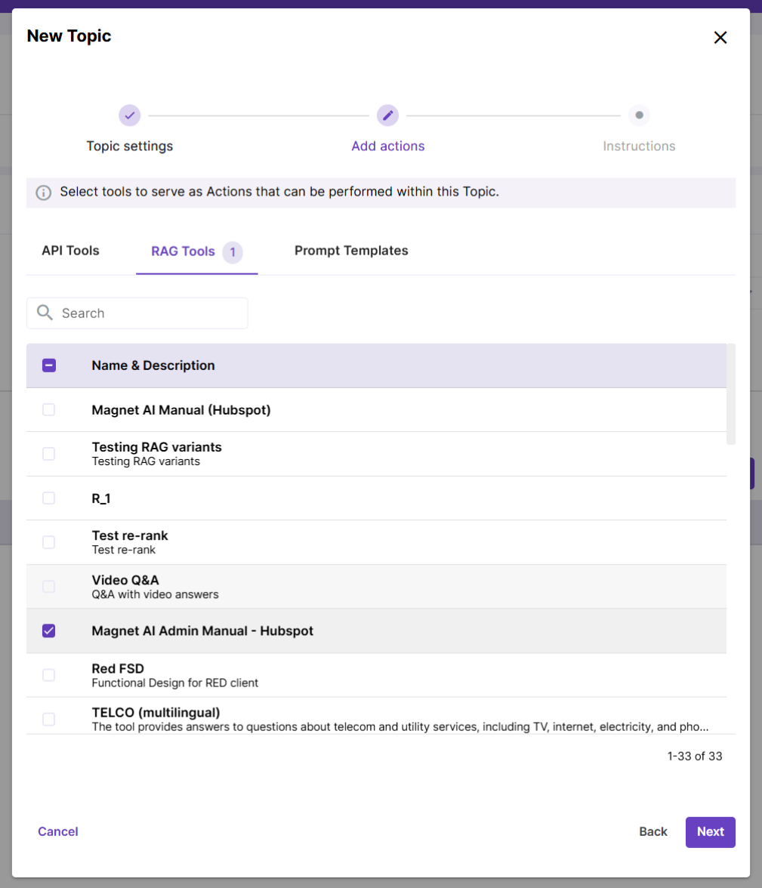

## 7. Review Agent instructions

[Topic Selection Prompt Template](../../../admin/configure/prompt-templates/default.md) and [Topic Processing Prompt Template](../../../admin/configure/prompt-templates/default.md) are selected by default, and they should work well for your agent’s first iteration. So, you can skip this step for your first iteration of Agent configuration.

If you still need to cuztomize these prompt, you can clone the default Prompt Templates, adjust them and then replace them in your Agent.

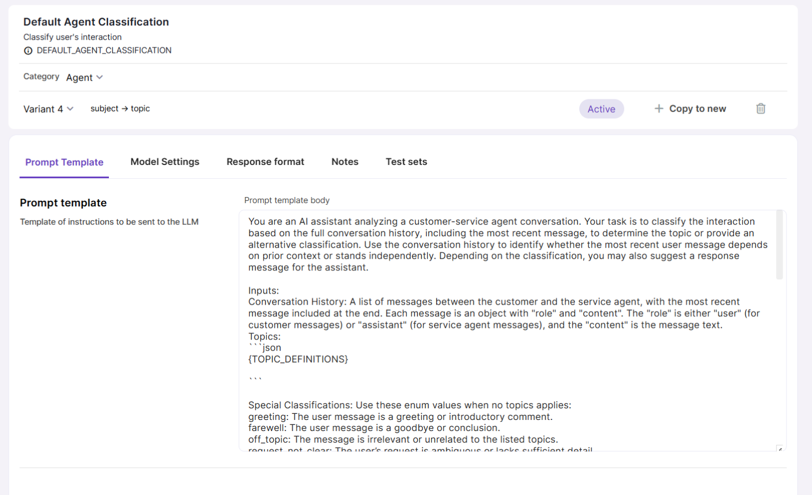

## 8. Adjust additional Agent settings

Make sure you enable post-processing to collect business metrics like user sentiment, case resolution status and conversation language.

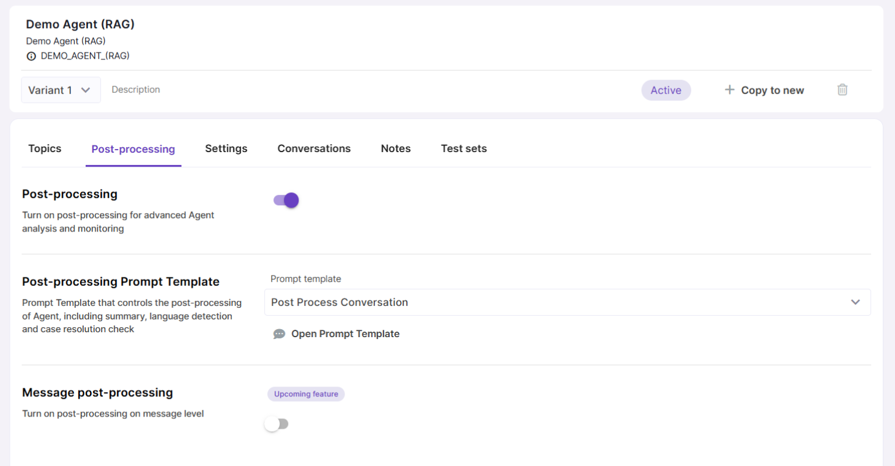

In the Settings tab, you can enter a Welcome message for the user to see when they open a new conversation. Also, use this tab to enable user feedback and provide some sample questions to give users a hint on what kind of questions they can ask.

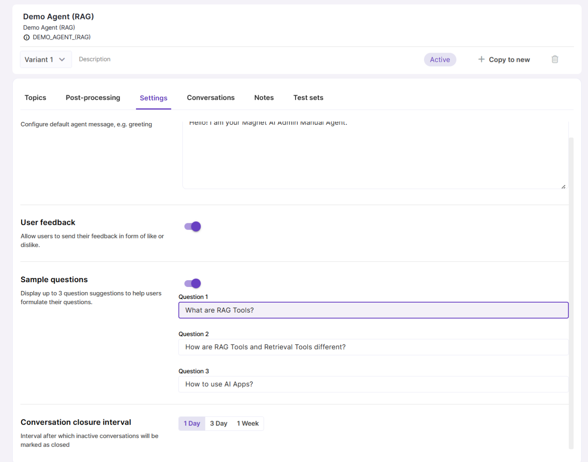

## 9. Preview and save your Agent

Use the Preview panel to test how your Agent works and looks on the fly.

To view Agent execution steps, click the bolt icon below the Agent's response. This feature is useful for debugging your Agent. Try creating multiple Variants to test and compare different options.

Once you are happy with the results, click **Save**.

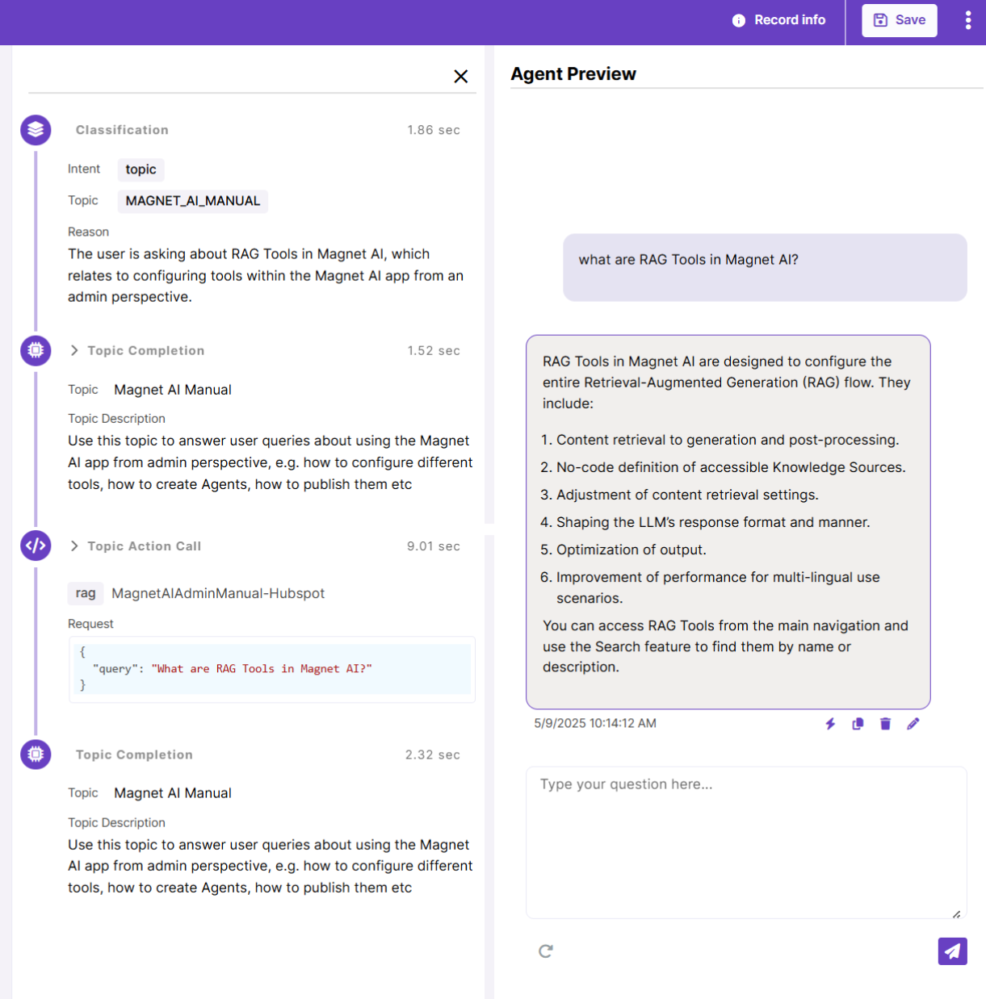

## 10. Publish your Agent

The fastest way to deliver your Agent to end users is by packaging it in an AI App - a compact embeddable UI panel. Head over to the [AI Apps](../../ai-apps/overview.md) screen and create a new AI App. Then, create an AI Tab and set its type to 'Agent'. Select your Agent and save.

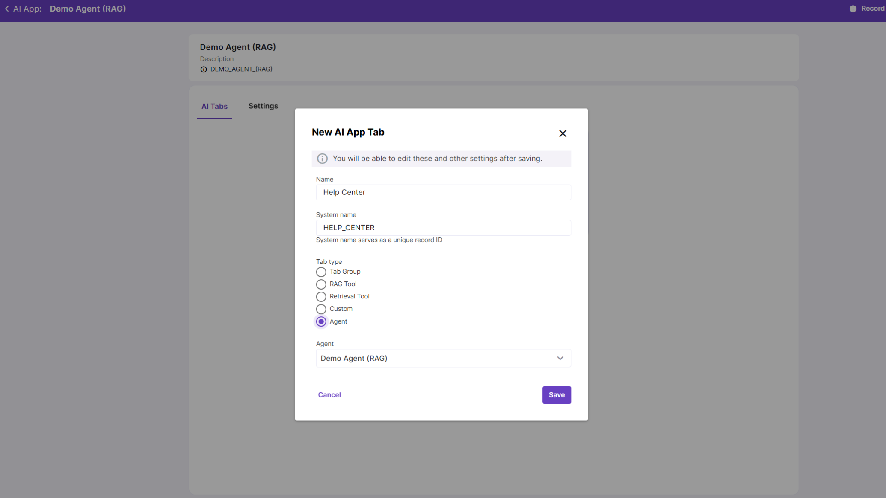

AI Apps come in two themes: Salesforce and Oracle Redwood-style. Let’s pick the Salesforce theme.

> Please note that unlike with other tools, you first need to save your AI App to see actual changes in the Preview panel.

AI Apps can be embedded into external systems via URL or called via API using system name.

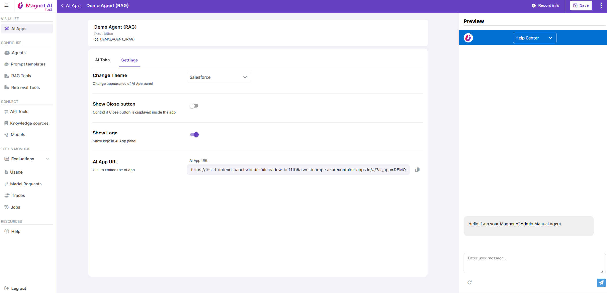

## 11. Monitor your Agent

You're all set with the configuration, but the continuous monitoring and optimization process is just beginning! Once your agent is live, be sure to track its costs, performance, and user satisfaction through the [Usage](../../usage-dashboards/overview.md) reports.

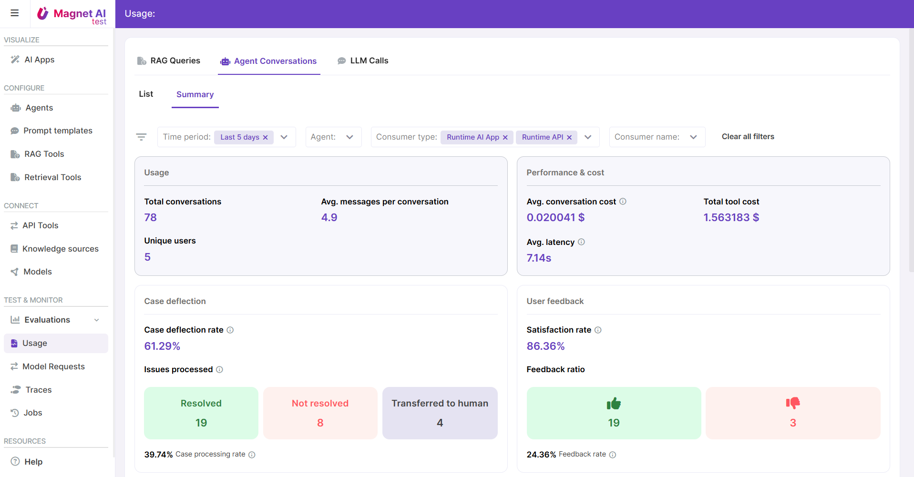

Make sure you also check the RAG Queries dashboard for insights on your RAG Tool performance.

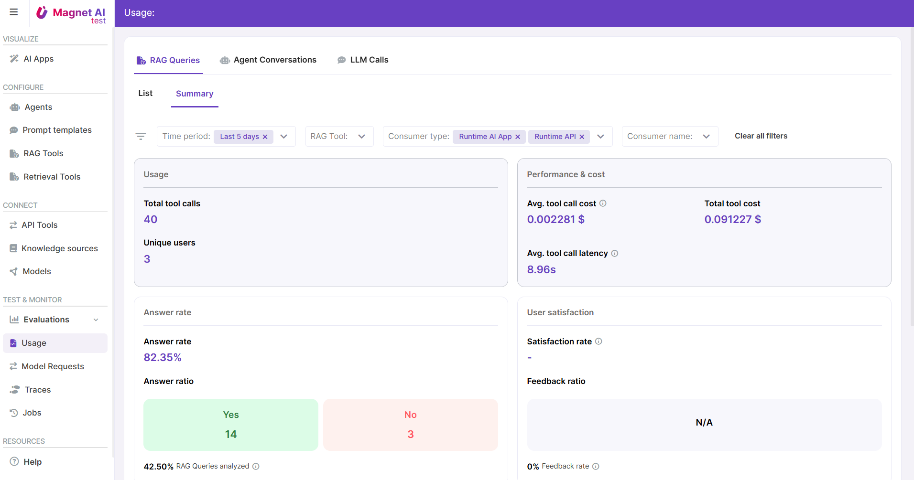
