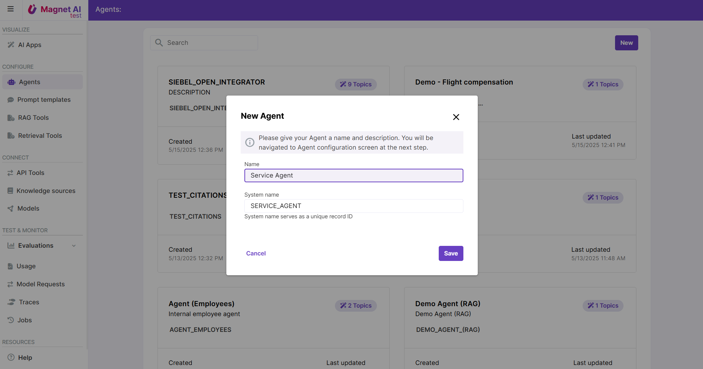

# What is Magnet AI

Magnet AI is a free, open-source, low-code platform for CRM consultants and application experts who understand the potential of Generative AI but aren't AI engineers. 

Magnet AI users can rapidly create AI-powered features, even without Python skills. Magnet AI solutions natively integrate with Salesforce, Siebel, and can be embedded or integrated into other applications.

