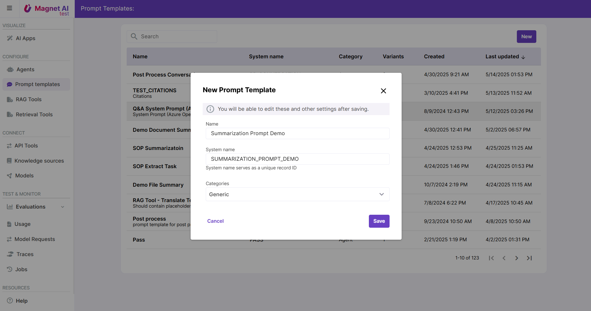

# Steps to Configure a Prompt Template

Configuring a Prompt Template consists of 4 steps:

1. Write instructions for the LLM
2. Adjust LLM settings *(optional)*
3. Adjust response format *(optional)*
4. Test and Save.

[Read more](../../../en/admin/configure/prompt-templates/configuration.md) about Prompt Template configuration.

