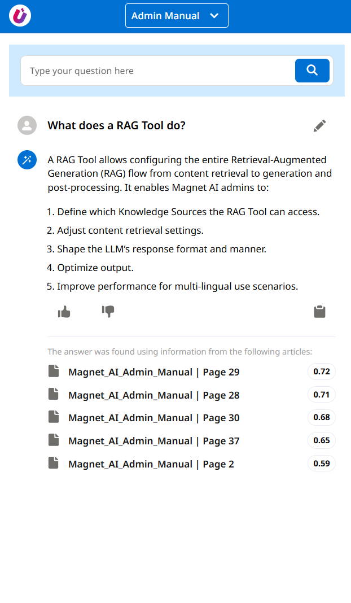
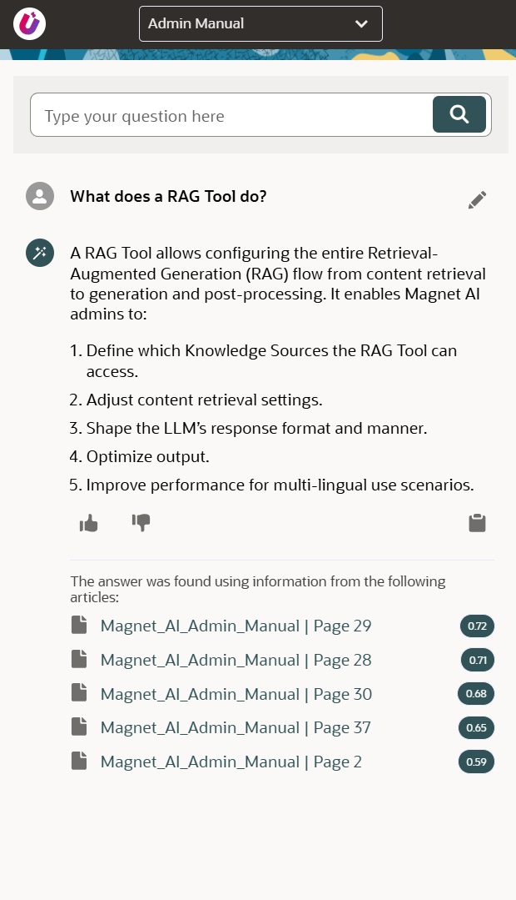

# Using RAG Tools

## Using RAG Tools in Agents

RAG Tools can be used by Agents when an Agent understands it needs to provide an answer from a knowledge base. To so do, configure a RAG Tool and add it as an Agent Action.

[Read more](../../../en/admin/configure/agents/configuration-topics.md) about configuring Agents.

## Using standalone RAG Tools

A typical use case for RAG Tools is the Q&A feature. While Q&A can be a part of an Agent with broader capabilities, it can be also used on its own and delivered to end users either as part of an [AI App](../ai-apps/overview.md) or called directly via API.

Publishing a RAG Tool via an AI App requires just a few clicks to add it to a configurable UI panel that can be embedded into your system with minimal setup. AI Apps support Salesforce and Oracle Redwood themes, and can host multiple AI tools organized into tabbed interfaces. 

So, once your RAG Tool is ready, just add it to an AI App, grab the generated URL and embed the app into your CRM. For a more tailored usage, call the AI App by its system name.

