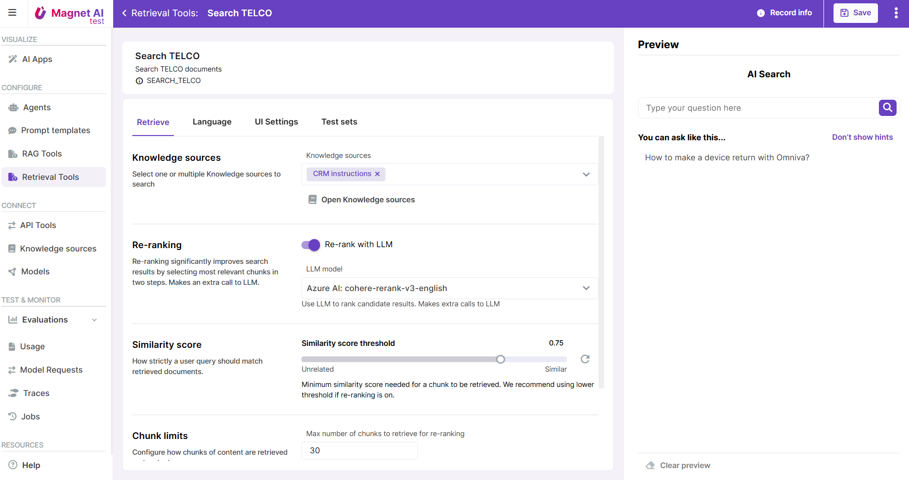

# Retrieval Tools

Retrieval Tools provide an enhanced Semantic search experience. They have a lot in common with [RAG Tools](../rag-tools/overview.md): you can configure their similarity score threshold, optimize for multi-lingual use cases, toggle user feedback or add re-ranking just as with RAG Tools. The key difference is that Retrieval Tools do not generate a text answer to user’s query. They just return the most semantically relevant chunks of content.

Retrieval Tools work well for use cases when users need to get links to best-matching pieces of content such as instructions or manuals, and re-generating the original wording does not bring added value.

