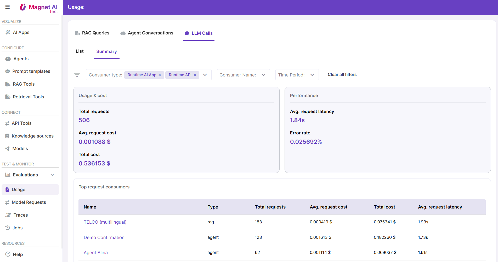

# LLM Usage

This report provides informaton about LLM calls for the maximum of 7 last days.

It comes in a list view and an analytical dashboard where you get an overview of LLM calls grouped by consumer (like a specific AI App or an external system).

This report helps admins monitor and understand costs and parameters of LLM calls made by the entire Magnet AI ecosystem, from end-user features to internal processes like scheduled jobs.

The LLM Calls report helps identify the most resource-intensive consumers and understand which factors are driving high resource consumption - whether it's a costly model, a large context, or excessive model calls made by a tool.

