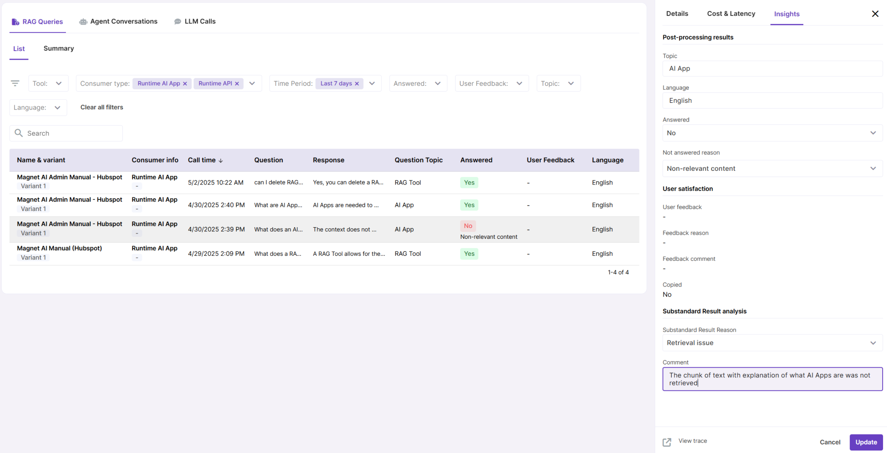

# RAG Queries

This report provides informaton about RAG Tool calls for the maximum of 7 last days.

It comes in a list view and an analytical dashboard where you get an overall summary of all RAG Tool calls and more summaries for specific RAG Tools.

You will notice that some values in the “Insights” tab inside query records are editable. This is because these metrics are generated by the LLM and, due to the nature of LLM generation, these sometimes need to be adjusted by human.

Additionally, there are two fields for "Substandard result analysis." When analyzing unsatisfactory outputs, human analysts can document their findings in these fields.

### How to make the most of RAG Usage feature

- **Enable user feedback** to track user likes, dislikes, and comments. Enable this feature in the UI Settings tab of RAG Tool configuration.
- **Enable Post-processing** on your RAG Tools to collect data about language, topic and whether the question was answered or not. This data is generated by the LLM, so sometimes it might need a human adjustment. For this purpose these fields are editable in the reports.
- Use the **“View trace”** link in record details to view detailed information about RAG Tool call - using this data, you can track down existing issues and document your findings in the **"Substandard result analysis"** section.

