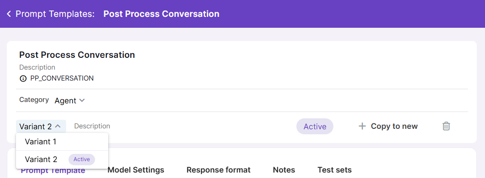

# Variants

**Variants** allow you to test and compare multiple configuration options in Magnet AI. This helps admins optimize output performance and accuracy while balancing cost and efficiency.

Currently, variants are supported by Prompt Templates, RAG Tools, API Tools, and Agents.

You can select specific variants during an [Evaluation](../evaluations/overview.md). However, when configuring a tool that references another tool with variants, the **active variant** of the referenced tool is always used.

To create a new variant, click the `Copy to new` button.

Variant names are automatically generated using a sequential numeric suffix. You can also add an optional description for each variant. For example, for a Prompt Template variant, it might be useful to mention critical LLM parameters in description.

When an active variant is deleted, the previous variant is automatically activated.

