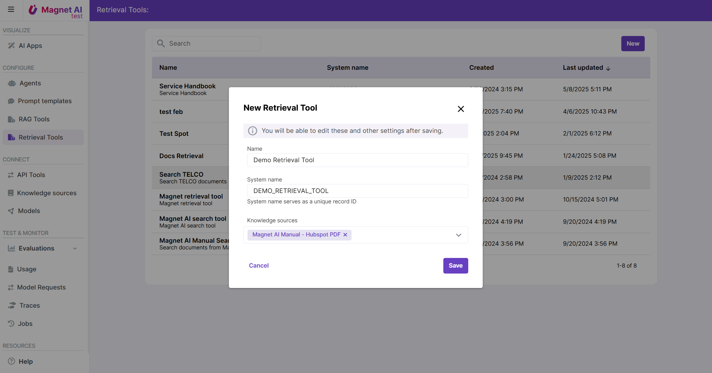

# Meklēšanas rīka konfigurēšanas soļi

Meklēšanas rīka konfigurēšana ietver 5 soļus:

1. Izvēlieties vienu vai vairākus zināšanu avotus, kuros tiks veikta meklēšana
2. Pielāgojiet papildu meklēšanas iestatījumus, lai optimizētu rīka darbību _(pēc izvēles)_
3. Aktivizējiet daudzvalodu meklēšanu _(pēc izvēles)_
4. Pielāgojiet UI iestatījumus, lai iegūtu vizuāli pievilcīgu izskatu _(pēc izvēles)_
5. Testējiet un saglabājiet.

Lasiet vairāk par meklēšanas rīku konfigurēšanu.

